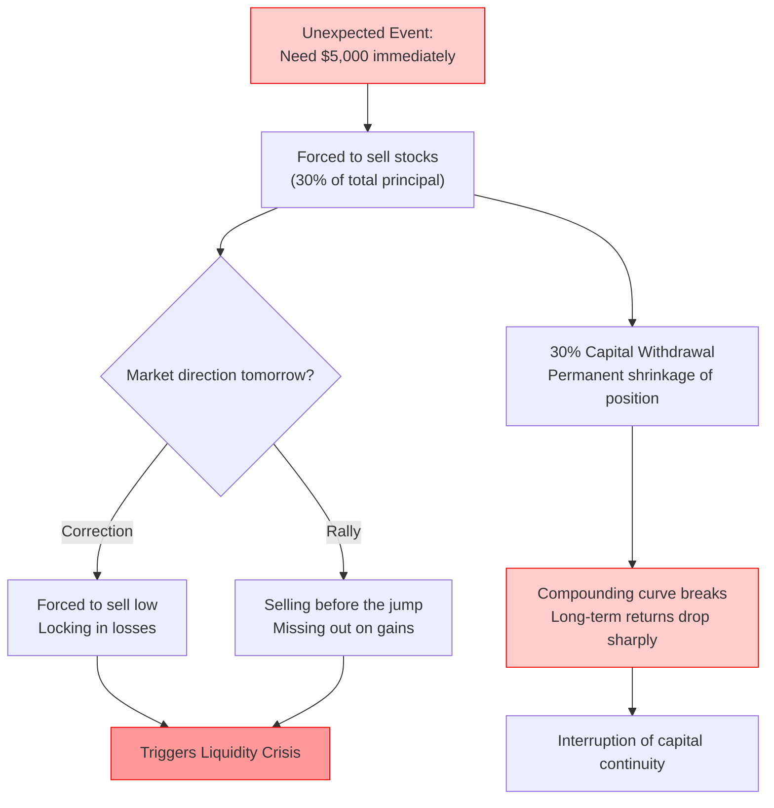
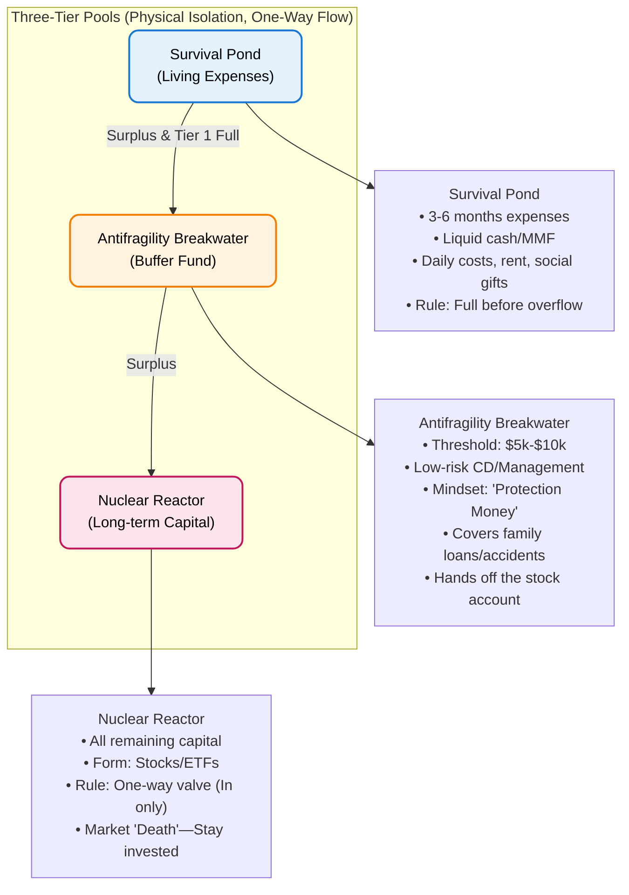

import { Aside } from 'astro-pure/user'
import { Collapse } from 'astro-pure/user'
import { CardList } from 'astro-pure/user'

> Does family matter? Yes and no. Does money matter? Yes and no.
No matter how sophisticated your trading system is, "Being Water"—remaining calm and fluid—is the ultimate leverage against the unpredictability of life.

## 0x0 Introduction

There is a cliché in the investment world: "Trading is against human nature."

Commonly, this is interpreted as **the inability to hold onto stocks due to greed and fear**. However, a recent event made me realize that for ordinary people trying to change their destiny through trading, the true "anti-human" element lies elsewhere:

<Aside>**The rational curve of compounding is often incompatible with the messy reality of human life.**</Aside>

Just as I thought I had built a perfect trading system and was ready to use the leverage of time to achieve financial freedom, a sudden phone call shook me. It made me realize that what stops the average person from moving up the social ladder isn't usually their stock-picking skills, but the ubiquitous **"Systemic Hard Coupling"** of life.

## 0x1 Capital is Security

My father called today—a rare occurrence.
The story was an old one: **He had lent money to someone behind my mother's back to earn interest. Now, to settle a family dispute, he needed me to provide $5,000 to fill the hole. He even sent a photo of the IOU to reassure me.**

Rationally, I know this money isn't "lost"; it's just moving from one family pocket to another. But in my **financial logic**, this is a disaster. This $5,000 isn't just "spare cash" sitting in a bank; it is the core "fuel" (Capital) of my trading system.

For someone whose capital is fully deployed, being forced to liquidate stocks tomorrow is a classic **Liquidity Crisis**:

<Aside type='danger'>
- If the market corrects tomorrow, I am forced to "cut meat" (sell at a loss).
- If the market rallies, I suffer an "opportunity cost" by being out of the game.
</Aside>

Even more critical: this amount represents **30% of my current investment principal**.

Withdrawing 30% of your principal causes the compounding model to collapse instantly. The hardest part of building a trading system for an average person isn't the technology—it’s **capital continuity**.

One only dares to commit to a long-term investment plan when they have an absolute sense of future security. This phone call precisely shattered that certainty. It’s a vicious cycle: the more you need security, the harder you work to accumulate; yet life, through "family ties" or "accidents," harvests that security just as you reach a critical accumulation phase.

<Collapse title="View [Capital Chain Rupture Simulation]" mode="preview">

</Collapse>

## 0x2 The Invisible Drain of Consumption

This sense of helplessness comes not just from sudden shocks, but from daily **Financial Entropy**.

I pride myself on earning a high salary in a Tier-1 city and living a low-desire lifestyle. I expected my 2025 savings to look like a beautiful exponential growth curve. **But looking at my account balance, I fell silent.**

Even without major expenses like a car or a house, there are always mysterious "acts of God": **_a dinner with friends, a sudden cold, an appliance that had to be replaced._** These seemingly minor expenses are like barnacles on a ship's hull—quietly slowing down the vessel.

We constantly overestimate our planning abilities and underestimate the chaos of life:

- Buying a house, getting married, and having children are **Planned Drawdowns**.
- Accidents, illnesses, or a call from your father are **Unplanned Crashes**.

The root of the pain is that our **Life System** and **Investment System** are **Hard Coupled**. Whenever life vibrates, the investment system collapses.

## 0x3 Establishing a Three-Tier Buffer

Since we cannot predict accidents, we must achieve **Decoupling** at the systemic level.

Currently, my money exists in only two states: "to be spent" or "to be invested." This is too fragile. I need to build a physically isolated **Three-Tier Capital Pool** to act as a breakwater against the waves of life:

<CardList title='The Three-Tier Capital System (Click to View)' mode="preview" list={
  [
    { 
      title: '1. Tier 1: The Survival Pond', 
      children: [
        { title: 'Definition: 3-6 months of living expenses (Absolute cash/Money Market Funds).' },
        { title: 'Role: Covers daily expenses, rent, and social gifts.' },
        { title: 'Golden Rule: If this pond isn’t full, no capital moves to the next tier.' }
      ] 
    },
    { 
      title: '2. Tier 2: The Antifragility Breakwater', 
      children: [
        { title: 'This is the missing link for me and most young professionals.' },
        { title: 'Definition: A "Trouble Threshold," e.g., $5,000 - $10,000.' },
        { title: 'Form: Low-risk wealth management or Certificates of Deposit.' },
        { title: 'Mindset: Logically, this money doesn’t belong to me. It is the "protection money" I pay to the bastard called Life. If no emergency happens in a year, I’ve made a profit. If something happens (like my father needing money), it is drawn from here, leaving the stock account untouched.' }
      ] 
    },
    { 
      title: '3. Tier 3: The Nuclear Reactor (Long-term Capital)', 
      children: [
        { title: 'Definition: All remaining funds.' },
        { title: 'Form: Stocks, ETFs.' },
        { title: 'Golden Rule: A one-way valve. Capital goes in, but never comes out. Even if the sky falls, this money stays put.' }
      ] 
    },
  ]
} collapse />

<Collapse title="View [Three-Tier Pool Logic Diagram]" mode="preview">

</Collapse>

## 0x4 Cultivating the Mindset

Once the architecture is built, the "software"—your **mindset**—needs an upgrade.

Yes, I am anxious right now: Is it worth breaking the rules I worked so hard to establish for the sake of family?

<Aside type='caution' title='You should know it!'>**If this happens again in the future, how will I resist?**</Aside>

As I wrote in my raw notes: **"To avoid eating shit in advance..."**

If an accident is destined to happen, then "worrying about the accident" is just eating the shit once before it even arrives. When the real accident happens, you have to eat it again. This is not just ineffective; it’s foolish.

I need to establish two psychological firewalls:

**1. Execute an "Immediate Write-off" policy:**
Regarding loans to family, do not record them as "Accounts Receivable." That only leads to daily internal friction.
The correct approach: The moment the money leaves your hand, mark it as an **Expense/Gift** in your mind. Your balance sheet hits zero immediately. If they pay it back later, it’s a **Windfall**; if they don’t, it was already expected.

**2. Build a "High Net Worth, Low Liquidity" Persona:**
To prevent future moral kidnapping, you need a social firewall. Next time someone asks for a large loan, use the **Liquidity Circuit-Breaker Script**:

> "Dad, to force myself to save, I put all my money into a 3-year fixed-term fund. If I withdraw it now, I lose all the principal. I only have a few hundred dollars in my daily spending account."

<Aside>This isn't lying; it's a flow-control mechanism to protect your investment system from external emotional interference.</Aside>