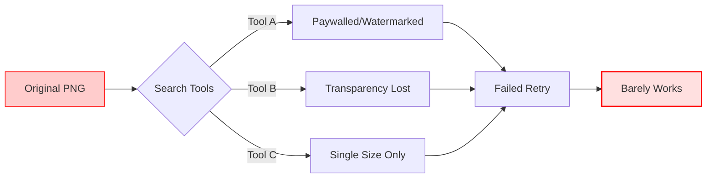
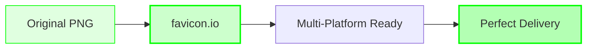

---
title: 'The Ultimate Favicon Solution for Websites'
publishDate: '2026-01-10'
description: "For low-frequency but critical tasks, we don't need more options—we need a definitive answer."
heroImage: { src: './cover.png', color: '#64748b' }
tags:
  - Tools
  - Efficiency
language: 'English'
---

import { Aside } from 'astro-pure/user'
import { CardList } from 'astro-pure/user'
import { Collapse } from 'astro-pure/user'

> The time spent searching for tools often exceeds the time spent using them. For low-frequency essentials, we don't need more choices—we need a standard answer.

## 0x0 Introduction: The "Time Black Hole" of Mundane Tasks

In the long checklist of independent development, there are always those inconspicuous little tasks—like a grain of sand in your shoe.

I just completed an elegant website architecture, wrote complex backend logic, and was ready to wrap up when I got stuck on the final step: **uploading a Favicon (website icon)**.

What should be a 1-minute task often turns into 30 minutes of torment due to various technical hurdles:

<Aside type='caution'>
* **Format Barriers**: Converting PNG/JPG to `.ico` format, but random online tools often turn transparent backgrounds into black blocks.
* **Fragmentation Disaster**: Browsers need 16x16, iPhone home screens need 180x180, Android needs 192x192, plus Windows Tile...
* **Reinventing the Wheel**: Since this happens maybe once or twice a year, you end up Googling from scratch each time. The result? First three results are ads, fourth is paywalled, fifth has missing features.
</Aside>

The cognitive resources consumed by this "search + trial-and-error + correction" cycle often far exceed the time spent designing the icon itself.

**For low-frequency but essential operations like this, we don't need "more options"—we need a validated "standard answer."**

---

## 0x1 Where Does the Time Go?

Why do I strongly recommend standardizing specific tools in your workflow? Let's audit the efficiency gap between **"random searching" and "standardized processes"** with a logic diagram:

<Collapse title="Click to View【Efficiency Comparison】" mode="preview">

**❌ Traditional Inefficient Process** (High Entropy):

**✅ Standardized Process** (Deterministic, One-Shot):

</Collapse>

The left flow is filled with uncertainty (entropy)—each click is a gamble. The right flow is linear and deterministic.

**Master-level efficiency comes from eliminating these unnecessary micro-decisions.**

---

## 0x2 The Ultimate Solution: favicon.io

For favicon needs, I recommend only one tool. Bookmark it now and end all future searching.

**Tool Name**: [favicon.io](https://favicon.io/)

This isn't just a simple converter—it's a **comprehensive icon solution for all platforms**.

<CardList title='Core Advantages Audit' mode="preview" list={
  [
    {
      title: '1. Automatic Multi-Platform Adaptation',
      children: [
        { title: 'It doesn\'t just generate .ico files.' },
        { title: 'It automatically outputs the full suite of standard sizes: iOS (Touch Icon), Android (Chrome), Windows (Metro Tile), macOS (Safari Pinned Tab), and more.' }
      ]
    },
    {
      title: '2. Code-Level Delivery',
      children: [
        { title: 'This is the sexiest part.' },
        { title: 'It doesn\'t just give you a zip of images—it generates a complete set of standard `<link>` and `<meta>` tags. No need to look up documentation for "what tag does Android use"—just copy and paste.' }
      ]
    },
    {
      title: '3. Minimalism',
      children: [
        { title: 'Free, no pop-ups, no forced registration.' },
        { title: 'This is what a tool that respects your time should look like.' }
      ]
    }
  ]
} collapse />

**Standard Operating Procedure:**
1.  **Upload**: Upload a high-res PNG (512x512 or larger recommended).
2.  **Config**: Fine-tune platform-specific display (background color, padding) in the visual interface.
3.  **Generate**: Click generate, download the package, copy the HTML code.

---

## 0x3 Deep Thought: The "Silent BGM Effect" of Tools

The reason I'm dedicating a post to this small tool is that it perfectly embodies my definition of a great product: **"Silent BGM" (Background Music)**.

<Aside>
If you're not actively listening for it, you won't even notice the BGM's presence. But if it disappears or is mismatched, the entire atmosphere of a scene instantly collapses.
</Aside>

Great development tools work the same way:
* **No Showboating**: No flashy UI, no forced feature presence.
* **No Interruption**: No additional learning curve required.
* **Present When Needed**: Only when you need it does it solve your problem at maximum speed, making your development flow smooth and elegant.

As we build our own systems, we should aim to collect more of these "silent BGM" tools.

Bookmarking it isn't just about saving a URL—it's about confidently skipping meaningless vetting time the next time you face tedium, reserving your mental energy for code that truly matters.

> Pro tip: It supports not just images, but also text and Emoji.
