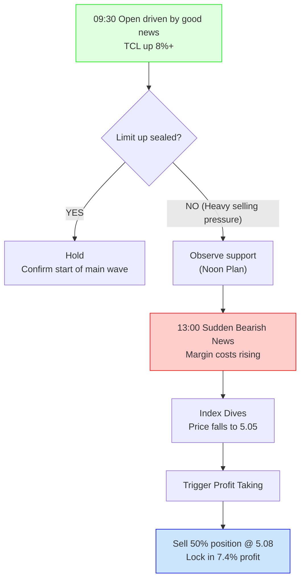

import { Aside } from 'astro-pure/user'
import { CardList } from 'astro-pure/user'
import { Collapse } from 'astro-pure/user'

> The market is always pricing in the future. When everyone is cheering for the certain past (earnings reports), traders must stare at the uncertain present (order book).

## 0x0 Dopamine and a Cold Shower

This morning's opening was a typical **dopamine feast**.

TCL Technology (000100) opened high and surged, at one point soaring nearly **9%**. Watching the numbers on the screen turn a deep red (in China, red means up) and seeing the position I bought back just a few days ago instantly float a **7.4%** profit—this "precise bottom-fishing + positive news explosion" script is enough to spike any investor's adrenaline.

**The catalyst was a beautiful report card:** Last night's announcement showed strong revenue expectations for 2025, with TCL CSOT's net profit exceeding 8 billion yuan.

This is absolute fundamental good news. Logically, I should be resting on my laurels and counting my money. But after the brief excitement of lunch, my intuition (and that damn experience) started pouring cold water on me:

1.  **Sell the News**: The stock price had already reacted to this news in the morning session but failed to seal the upper limit (limit up).
2.  **Order Book Language**: There were massive sell orders hanging at the limit-up price, indicating that large funds were using the good news to "distribute" chips.
3.  **Déjà Vu**: This "surge and fall back" script was just played out last week.

In the afternoon, sudden bearish news about "tightening margin requirements" hit the A-share market, and the index dived. The morning's hesitation turned into the afternoon's resolution—**I hit the sell button.**

## 0x1 TCL Technology: From Expectation to Realization

This was a textbook **expectation management** operation.

**Reviewing the Logic Chain:**
*   **Buy Point**: 5 days ago (Jan 9), a rational return after a round of family changes; this was a play based on technical oversold conditions.
*   **Explosion Point**: Today (Jan 14), an emotional release based on fundamental news (8 billion profit).
*   **Sell Point**: Intra-day afternoon, price broke below 5.08 RMB.

I chose to **take profit on 50%**.

<Aside type='tip'>
Why not sell everything? Because the trend hasn't completely turned bad yet; keeping a base position prevents missing out on a potential subsequent "main rising wave."
Why not keep everything? Because failing to seal the limit up is a sign of weakness. Combined with the afternoon's macro bearishness, I had to lock in this 7.4% profit to prevent a "roller coaster" tragedy.
</Aside>

<Collapse title="Click to View [Intraday Trading Decision Tree]" mode="preview">

</Collapse>

This also verifies a view I've always held: **Since we cannot predict what bad news might appear in the afternoon, when the morning market gives a premium, taking some of your money off the table is never wrong.**

> As long as you made money, it doesn't stink.

## 0x2 Hang Seng Index: Leverage is the Enemy of Time

If the TCL operation was a tactical "profit-taking," then clearing the **2x Long Hang Seng Index** position in the afternoon was a strategic **dimensionality reduction**.

This trade was also quite profitable, gaining over 10% from the bottom rebound. But my core logic for clearing it wasn't because it stopped rising, but because of **time cost**.

In a margin account, leverage has an invisible tax. An 8% annualized margin cost means:
*   If the market goes sideways, I'm losing money.
*   If the market rises slightly, I'm just breaking even.
*   Only if the market surges can I beat the cost.

<CardList title='Liquidation Logic Audit' mode="preview" list={
  [
    {
      title: '1. Resistance Confirmation',
      children: [
        { title: 'The Hang Seng Index has rebounded to previous highs (upper box limit) and will likely enter a period of oscillation and digestion.' }
      ]
    },
    {
      title: '2. Friction Cost',
      children: [
        { title: 'Holding leverage in a choppy market is foolish. Time is the enemy of leverage, but the friend of cash.' },
        { title: 'Paying certain high interest for an uncertain "tail end" of a trend—the math just doesn\'t add up.' }
      ]
    },
    {
      title: '3. Macro Resonance',
      children: [
        { title: 'News of rising financing costs in A-shares is essentially tightening liquidity. As an offshore market, Hong Kong stocks are extremely sensitive to liquidity.' }
      ]
    }
  ]
} collapse />

## 0x3 US Stocks Hesitation and the "Wisdom of Empty Positions"

Now, the pressure is on the US stock account.

Logically, I also want to reduce leverage in US stocks. Currently, US stocks are in an awkward **high-level box oscillation** zone:
*   **Bullish**: It seems poised to break through previous highs at any moment.
*   **Bearish**: It's at the upper edge of the box, the risk-reward ratio is terrible, and the high-interest-rate environment hangs overhead like a sword.

This state of **not quite rising, not quite falling** is the ultimate test of human nature.

But I've decided to **observe a bit longer**.

When the direction is unclear, don't force trades. Instead of getting slapped on both sides in a choppy market, it's better to lower expectations and wait for the market to show a clear direction.

---

## 0x4 Conclusion: Cash is King Right Now

Today's operations can be summarized in one keyword: **Contraction**.

1.  **TCL Technology**: Used good news to contract position size and lock in profits.
2.  **Hang Seng Index**: Used high prices to contract leverage and avoid costs.
3.  **Overall Strategy**: Shifted from an aggressive offensive stance to a defensive "ambush" mode.

<Aside>
Investing isn't about who makes more when the wind is at their back, but who survives longer when the wind is against them.
</Aside>

When the macro environment starts to tighten (rising financing costs) and when individual stock good news fails to push prices to the limit up, the market is quietly telling you: **"The wind is stopping, fold your wings for now."**

Today, I have fewer chips than yesterday, but a bit more peace of mind for a good night's sleep.
