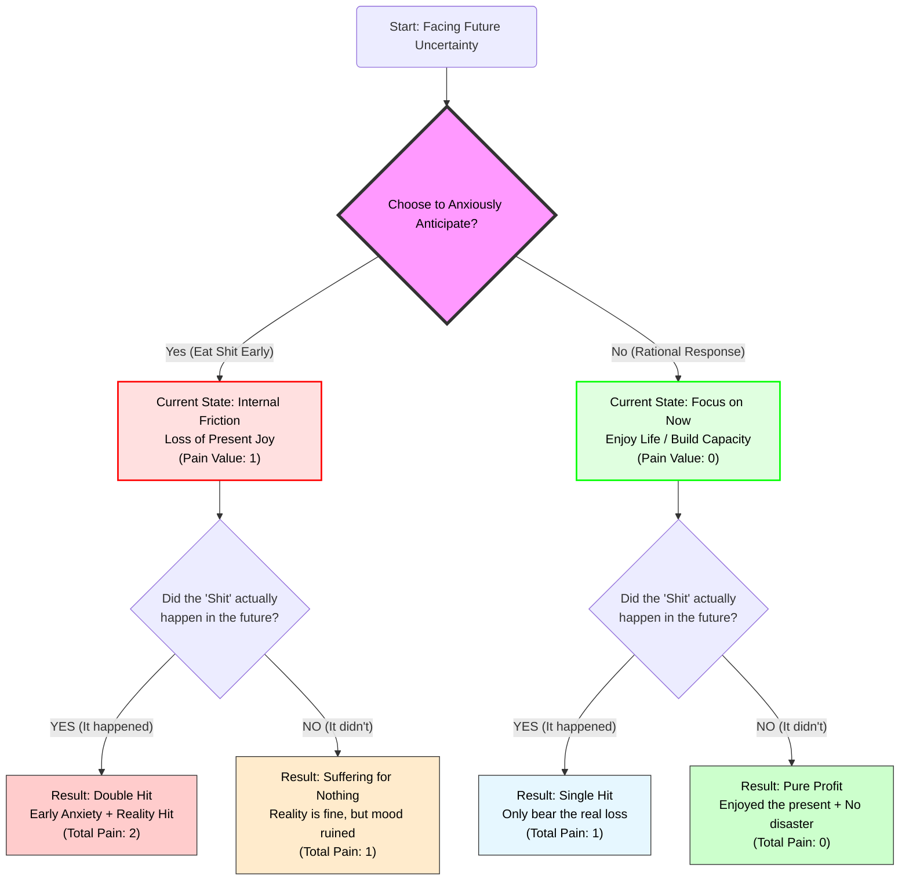
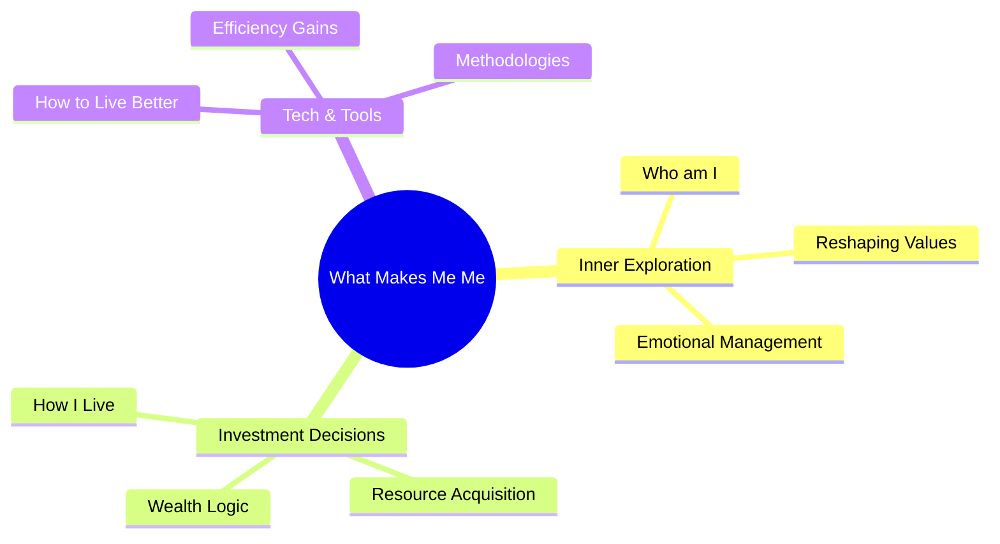

import { Aside } from 'astro-pure/user'
import { CardList } from 'astro-pure/user'
import { Collapse } from 'astro-pure/user'

## 0x0 Between "Rome" and the "Cave"

**I have spent a long time searching for the "optimal" way to live:**

<Aside> To never have to bow for a paycheck, never have to walk on eggshells around others, and never have to live in fear of an uncertain future. </Aside>

This seems to be a collective syndrome for almost everyone in their 20s.

We envy the lucky ones born in "Rome," yet forget that we weren't exactly born in the slums. We admire the stoicism of others while spending our nights ruminating on our own anxieties.

In pursuit of that goal called "Financial Freedom," I once locked myself in a lonely "cave," isolated from the noisy world.

I told myself this was all for my family, for the future. But after countless restless, sleepless nights, I began to ask myself: **Is this actually worth it?**

---

## 0x1 The Many Faces of Anxiety: "Eating Shit in Advance"

Over the past few years, my primary source of internal friction has boiled down to one word: **Money**.

Even though my current savings are enough to sustain my life, my brain involuntarily fast-forwards to the future—*What if I lose my job? What if a family member gets sick? What if the economy collapses?*

I used to call this "precautionary planning" and viewed it as a sign of maturity. But through a logical deconstruction of my inner world, I realized this is actually a profoundly foolish behavioral pattern. I call it **"Eating Shit in Advance."**

> The "Eating Shit" Theory:
Something bad might indeed happen in the future (the "shit"). But if you fall into suffering now because you're worried about that future, you haven't stopped it from happening. Instead, you've simply forced yourself to mentally experience the agony before it even arrives.

<Aside type='danger'>**The result: You end up eating shit twice.**</Aside>

Let’s look at this logic loop through a flowchart:

<Collapse title="View Logic Flow" mode="preview">

</Collapse>

**The conclusion is cold and hard:** Anxiety cannot prevent "Black Swan" events. The only thing we can control is whether we let the shadow of tomorrow swallow the sunlight of today. Even if the world is going to collapse tomorrow, I intend to fully enjoy the peace of this moment until the very second it does.

---

## 0x2 Life is a "Sandbox Experience"

When we detach from financial anxiety and zoom out to a cosmic perspective, "success" and "failure" become trivial.

*Wealth is one type of life experience; poverty is another. Holding power is one script; being unknown is another. In this massive sandbox game, no single setting is objectively superior to another.*

<Aside>**They are all just "experiences."**</Aside>

This is my core philosophy now:

- **Reject Secular "Optimal" Standards:** Even if the road is bumpy, and even if it's considered "bad" by societal standards—if I feel the texture of life in the process, it’s worth it. If I can help someone along the way, that’s a bonus.
- **Documentation is Meaning:** I am no longer obsessed with whether there is an audience or a "return on investment." I write to organize and record. If I can look back years from now and say, "I have no regrets about this life," that is enough.

Instead of chasing a finish line in a state of panic, I’d rather focus on the scenery along the road.

---

## 0x3 How to Live Better

> The anxiety caused by insomnia is often more damaging than the insomnia itself.

To combat this pointless nihilism, I decided to build this platform. This isn't an emotional dumpster; it's a **"Laboratory where Logic and Emotion Intersect."**

As someone obsessed with seeing through the surface to the essence, I’ve deconstructed my life exploration into three organic parts, which will serve as the three pillars of this blog:

1. **Who am I - Inner Exploration:**
    - Exploring psychology, philosophy, and self-awareness.
    - **Goal:** To build a strong core, find peace in a chaotic world, and help others do the same.
2. **How to Live - Investment & Decision Making:**
    - Sharing investment logic, wealth mindsets, and practical reflections.
    - **Goal:** Using rational resource allocation to buy back the freedom of choice.
3. **How to Live Better - Tech & Tools:**
    - Sharing efficient software, useful websites, and tech hacks.
    - **Goal:** Leveraging tools to boost efficiency, freeing up more time to actually "experience" living.

The logical relationship between them is as follows:

<Collapse title="View Mindmap" mode="preview">

</Collapse>
---

## 0x4 A Helping Hand or Self-Salvation

This might not be a grand stage, and there might not be any applause. But I choose to record and share regardless.

If my logical breakdown helps you untangle even one knot in your mind, or if my "Experientialism" gives you a moment of comfort during an anxious night, it will have been a great honor.

<Aside type="tip">
From today on, whenever you feel anxious about the future, stop and ask yourself: **"Am I eating shit in advance right now?"**
If the answer is yes, take a deep breath, return to the present, hug the people around you, or go solve a small, concrete problem right in front of you.
</Aside>

**Welcome to my world. Let’s find peace rationally in this crazy world, together.**