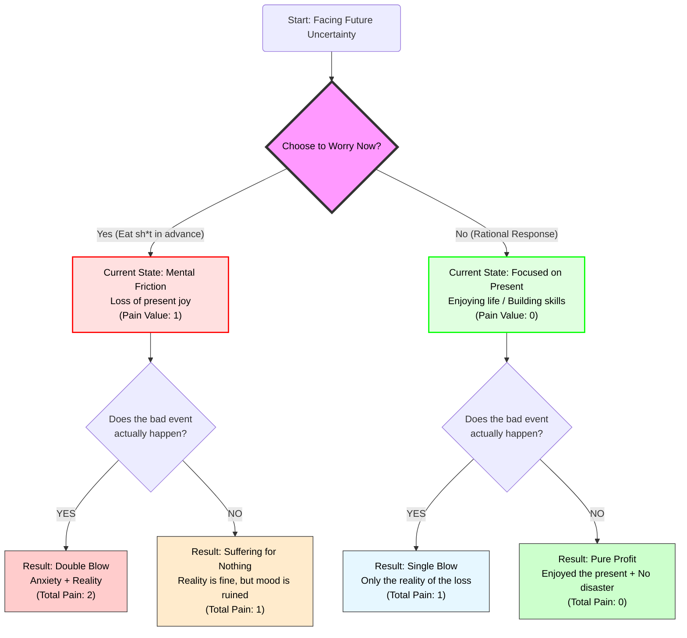
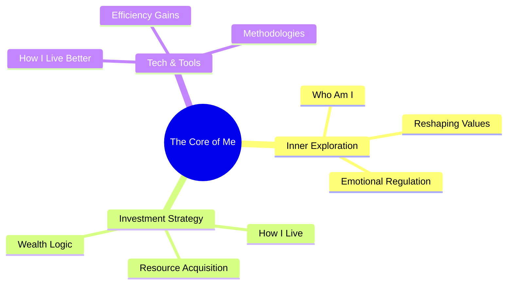

import { Aside } from 'astro-pure/user'

## Between "Rome" and the "Cave"

For a long time, I’ve been searching for a "perfect" way to live: one where I don’t have to compromise for money, bow to anyone's whims, or live in constant fear of an uncertain future.

This seems to be a collective "quarter-life crisis" for those of us in our 20s. We envy the lucky ones born in "Rome" (with silver spoons), forgetting that we weren't exactly born in the slums either. We admire others' nonchalance while privately ruminating on our own anxieties late at night.

Driven by the goal of "Financial Freedom," I once retreated into a lonely "cave" within this noisy world. I told myself it was for my family, for my future. But after countless restless nights, I started asking myself: **Is this actually worth it?**

---

## The "Pre-emptive Suffering" Trap

Over the past few years, my primary source of mental friction has boiled down to one word: **Money.**

Even though my current savings are enough to sustain my life, my brain instinctively fast-forwards to the worst-case scenarios: What if I lose my job? What if a family member falls ill? What if the economy collapses?

I used to call this "prudence" or "maturity." But through a logical deconstruction of my inner world, I realized this behavior is fundamentally irrational. I call it **"Eating Sh*t in Advance."**

> **The "Eating Sh*t in Advance" Theory:**
> A bad event (the "sh*t") might indeed happen in the future. But if you spend your present suffering because you’re worried about it, you haven't stopped it from happening. Instead, you've ensured that you experience the pain twice: once in your mind, and once in reality.
> 
> **The result: You ate the "sh*t" twice.**

Let’s look at this loop through a logic flow:

**The conclusion is cold and clear:** Anxiety does not prevent "Black Swan" events. The only thing we truly control is whether we let the shadow of tomorrow swallow the sunshine of today. Even if the world is going to collapse, I want to fully enjoy the peace of the second before it does.

---

## Life as an "Experience Game"

When we zoom out from money anxiety to a cosmic perspective, "success" and "failure" become trivial.

Wealth is one type of life experience; poverty is another. Power is one script; anonymity is another. In this massive sandbox game, no single setting is objectively superior. **They are all just "experiences."**

This has become my core philosophy:

- **Rejecting the secular "Good":** Even if the road is bumpy, and even if it's considered "bad" by societal standards, if I feel the "qualia" and texture of life in the process, it's worth it. If I can help a few people along the way, that’s a bonus.
- **Documentation is Meaning:** I am no longer obsessed with whether I have an audience or a "return on investment." I write to organize and record. If I can look back years from now and say, "I have no regrets about how I felt," that is enough.

Instead of racing toward a finish line in a state of panic, I’d rather focus on the scenery along the way.

---

## How to Live Better

> The anxiety caused by insomnia is often more damaging than the insomnia itself.

To combat this hollow nihilism, I decided to build this platform. This isn't an emotional dumping ground; it's a **"Laboratory of Reason and Emotion."**

As someone who loves looking through the surface to the essence, I’ve broken down my exploration of life into three organic parts, which will serve as the pillars of this blog:

1. **Who Am I (Inner Exploration):**
    - Exploring psychology, philosophy, and self-awareness.
    - **Goal:** To build a resilient inner core, find peace in a chaotic world, and help others do the same.
2. **How I Live (Investment & Strategy):**
    - Sharing investment logic, wealth mindsets, and practical reflections.
    - **Goal:** To use rational resource allocation to buy back my freedom of choice.
3. **How I Live Better (Tech & Tools):**
    - Sharing efficient software, useful websites, and life hacks.
    - **Goal:** To leverage tools to boost efficiency, freeing up more time to actually "experience" living.

---

## To Help Others, or to Save Myself

This might not be a grand stage, and there may be no applause. But I choose to record, and I choose to share.

If my logical breakdown helps you untangle even one small knot in your mind, or if my "experientialism" provides a moment of comfort during an anxious night, it will have been my greatest honor.

<Aside type="tip">
From today on, when you feel that creeping anxiety about the future, stop and ask yourself: **"Am I eating sh*t in advance right now?"**

If the answer is yes, take a deep breath. Return to the present. Hug someone you love, or simply go solve a small, concrete problem right in front of you.
</Aside>

Welcome to my world. Let’s find some peace together in this crazy world.