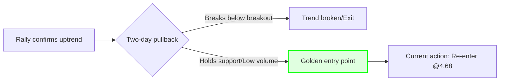
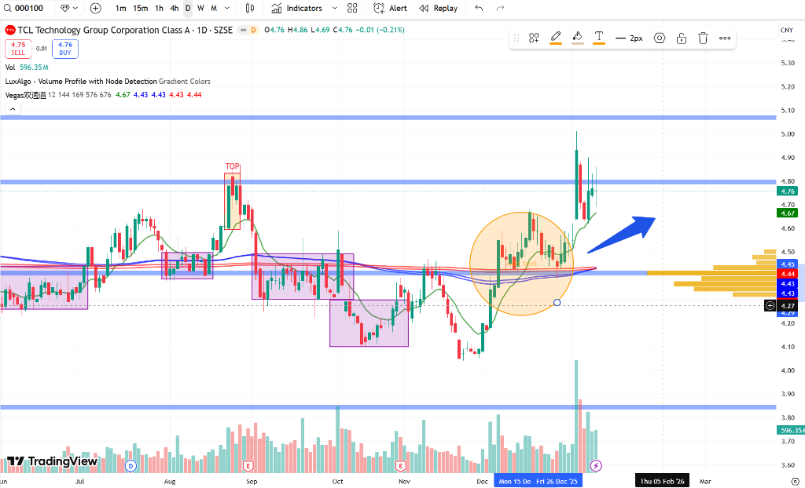
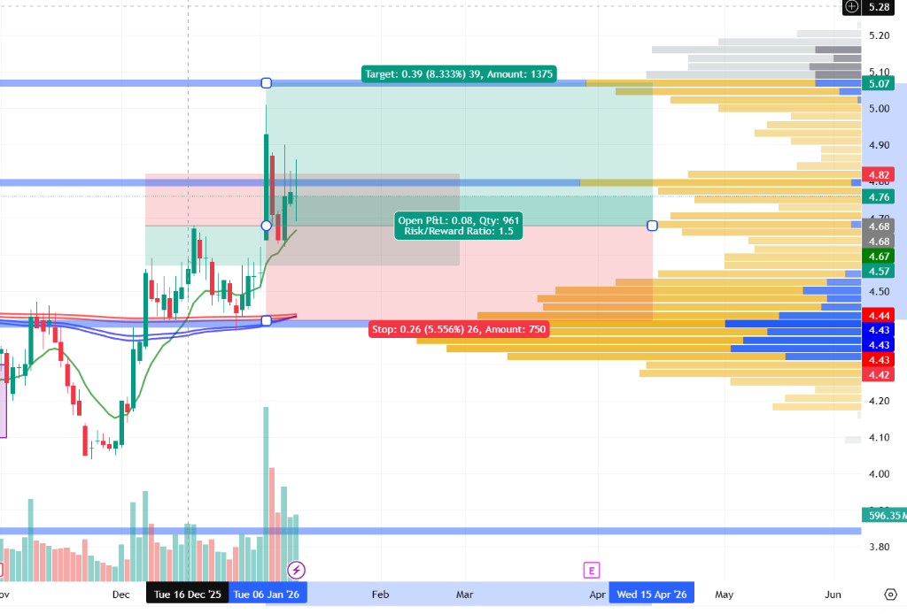

import { Aside } from 'astro-pure/user'
import { CardList } from 'astro-pure/user'
import { Collapse } from 'astro-pure/user'

> Of all trading mistakes, the most expensive isn't losing money—it's letting the emotional ghosts of your last trade haunt your current decisions.

## 0x0 Logic Reset

In my previous post, a family emergency (my father's debt) forced me to break my trading discipline and liquidate my TCL position. It was a textbook case of "life invading trading."

Just two days later, I chose to re-enter.

On the surface, this looks like classic retail investor behavior: selling high, then buying back after a small dip, wasting money on fees. But from a **system architecture** perspective, this was necessary.

The previous trade was **contaminated**—burdened by family obligations, anger, and helplessness.
This new trade is **clean**—purely based on charts, logic, and probabilities.

## 0x1 Technical Setup: The Golden Dip After the Rally

**Ticker**: TCL Technology (000100)
**Action**: Buy ¥10,000
**Entry**: ¥4.68 (Close: ¥4.64)

**Entry Logic:**

1.  **Trend Intact**: The two-day selloff was harsh, but it only retraced the recent rally without breaking below the breakout point. In an uptrend, this is often healthy consolidation.
2.  **Stock Character Arbitrage**: TCL has a grinding personality. The main players habitually shake out retail investors after rallies, using fear to accumulate shares. This dip is actually a buy signal within the system.
3.  **Excellent Risk/Reward**: The monthly uptrend channel remains intact, targeting the upper boundary.

<Collapse title="Click to view technical analysis" mode="preview">

</Collapse>

## 0x2 Trade Plan

This is my foundation for rebuilding order. No more "father's IOUs"—just cold, hard numbers.

<CardList title='Strategy Parameters' mode="preview" list={
  [
    {
      title: 'First Stop Loss: ¥4.57',
      children: [
        { title: 'Basis: 12-day moving average support.' },
        { title: 'Logic: Short-term trend lifeline. Breaking below signals excessive shakeout.' }
      ]
    },
    {
      title: 'Hard Stop Loss: ¥4.42',
      children: [
        { title: 'Basis: 120-day half-year line + volume profile support (¥4.44).' },
        { title: 'Logic: ¥4.44 is a massive accumulation zone. Breaking below means main players have abandoned ship—must exit unconditionally.' }
      ]
    },
    {
      title: 'Profit Target: ¥5.60 - ¥6.00',
      children: [
        { title: 'Basis: Monthly uptrend channel upper boundary.' },
        { title: 'Logic: Risk less than 5% downside for 20%+ upside potential.' }
      ]
    }
  ]
} collapse />

## 0x3 Formatting the Mental Account

Someone might ask: *"If you're bullish, why did you sell two days ago? Isn't this pointless?"*

Besides avoiding the nearly **6%** drawdown (which itself is massive alpha), more importantly, I completed a **Mental Accounting reset**.

If I hadn't sold, watching the decline would trigger thoughts like: "See, lending money to family messed up my mindset, now I'm watching my portfolio shrink." I'd spiral into endless mental friction.

But now, I've cleared the old cause-and-effect chain.

This is a brand new trade. No historical baggage, no family drama. **I paid one round of fees to buy back the purity of my trading system.**

<Aside type='tip'>
**Trading Philosophy:**
Sometimes, accepting you're being "dumb" and cutting complex narratives into independent, controllable tactical units is actually the best strategy for ordinary people fighting chaotic lives.
</Aside>
