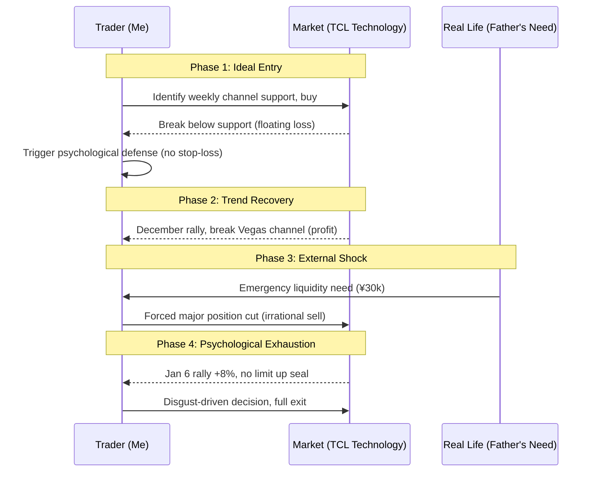

import { Aside } from 'astro-pure/user'
import { CardList } from 'astro-pure/user'
import { Collapse } from 'astro-pure/user'

> In the real world of investing, what defeats you is rarely a complex mathematical model. More often, it's an unexpected bill or accumulated psychological fatigue.

## 0x0 Introduction

We often say life is an experience. Financial markets, then, are the most concentrated, high-feedback arena within that experience.

Here, we attempt to use the most rational logic and coldest technical indicators to tame the wildest extremes of human greed and fear. Through "investor thinking," we hope to deconstruct anxiety and achieve rational calm.

**Yet reality has a way of slapping us hard in the face.**

When a perfect trading plan meets unexpected life events, when numbers on a screen must convert to cash for bills, our supposed "discipline" and "big picture thinking" often crumble instantly.

Today, I want to review a far-from-perfect trade—TCL Technology (Sept 2025 - Jan 2026). This isn't just a technical analysis exercise. It's a real-time record of **how external shocks and psychological attrition deform a logical trading model**.

<Aside>What we need to demystify isn't just the market—it's our illusion of control over ourselves.</Aside>

## 0x1 The Allure of Technical Patterns

Every story begins bathed in the light of reason.

In September 2025, I set my sights on TCL Technology.

Within my trading system, it showed a highly attractive setup: price had touched the lower bound of its weekly and monthly uptrend channel. In classic chart theory, this is a textbook potential reversal point—buying the dip.

Trusting the model, I started building a position.

But the market quickly taught me a lesson. The expected bounce never came. Instead, the stock broke below what I'd considered an "iron bottom"—the channel support.

**This triggered the first cognitive friction point:**

By strict discipline, a breakdown should trigger a stop-loss. But I fell into the classic **endowment effect**—_"It's already so low," "The company is still profitable."_ I used fundamental excuses to mask my failure to execute on technicals.

Fortunately, after two painful retests, the market turned in December. The 5-day moving average crossed above the Vegas channel upper band, forming a bullish alignment that seemed to validate my stubborn hold.

## 0x2 The Liquidity Crisis

If the story ended here, this might be another cheap motivational piece praising "persistence and faith." But real life is always messier than scripts.

Just as my account was in profit and the trend looked bullish, a completely external variable emerged—**my father urgently needed ¥30,000 in cash.**

At the time, my TCL position was worth about ¥40,000. This was an extremely awkward moment: you know your asset is in an uptrend, you know selling now contradicts your logic, but real-world liquidity pressure forces you to choose.

The result was brutal: **I was forced to sell ¥30,000 worth, representing 75% of my total position.**

<Aside type='danger'>
This sale had nothing to do with market analysis. It was pure **"dimensional downgrade attack"** from life to investing. It starkly revealed this truth: any unexpected life expense can become a forced "physical stop-loss trigger."
</Aside>

In this battle between algorithms and reality, reality won decisively.

<Collapse title="Click to View [Trading Logic Breakdown Sequence]" mode="preview">

</Collapse>

## 0x3 Psychological Attrition and the Art of Grinding

The remaining few thousand yuan position met its final fate on January 6, 2026.

That day, TCL Technology surged 8%, approaching the 10% limit up. But into the close, it failed to seal the limit. Based on long observation of this stock's "personality"—large cap, sleazy operator style, loves hanging big sell walls, constant upper wicks, habitual "grind down + big green candle" oscillation patterns—I decided to exit completely.

This sale wasn't forced, but it wasn't entirely rational either. It stemmed more from a sense of **psychological fatigue**.

I call this **Psychological Attrition**.

This stock was too "grinding." It lacked the unstoppable momentum of a big trend. Instead, it was full of petty, repetitive harvesting.

While post-analysis reveals fundamental risks—high debt, heavy capex, long payback periods, potential dilution—in that moment, what made me click sell was exhaustion with this torturous trading pattern.

Even if it rallied further, I didn't want to participate anymore. I chose to take certain gains in exchange for inner peace.

## 0x4 Deep Reflection: What Are We Really Trading?

Reviewing this trade, if you only look at the outcome, it was still profitable. But the process was full of compromises, accidents, and emotional decisions.

It gave me several profound insights:

<CardList title='Core Reflections' mode="preview" list={
  [
    {
      title: '1. Liquidity is the Highest-Level "Fundamental"',
      children: [
        { title: "Don't invest money you might urgently need in the short term." },
        { title: "No matter how perfect the chart, emergency bills always have top priority." }
      ]
    },
    {
      title: '2. Acknowledge the Finite Nature of "Psychological Capital"',
      children: [
        { title: "We're not emotionless AIs." },
        { title: 'Holding "grinding" stocks for long periods massively depletes psychological capital. When depleted, rationality goes offline.' }
      ]
    },
    {
      title: '3. Demystify "Persistence"',
      children: [
        { title: 'Sometimes "holding through without stopping out" isn\'t brilliance—just luck.' },
        { title: "Don't mistake luck for skill." }
      ]
    }
  ]
} collapse />

<Aside type='tip' title='Actionable Insight'>
**Audit Your "Emergency Fund"**:
Before any equity investment, ensure you've reserved at least 3-6 months of living expenses in cash. This money isn't for investing—it's a "breakwater" for your investment portfolio, preventing life's black swans from forcing you to sell the right assets at the wrong time.
</Aside>
