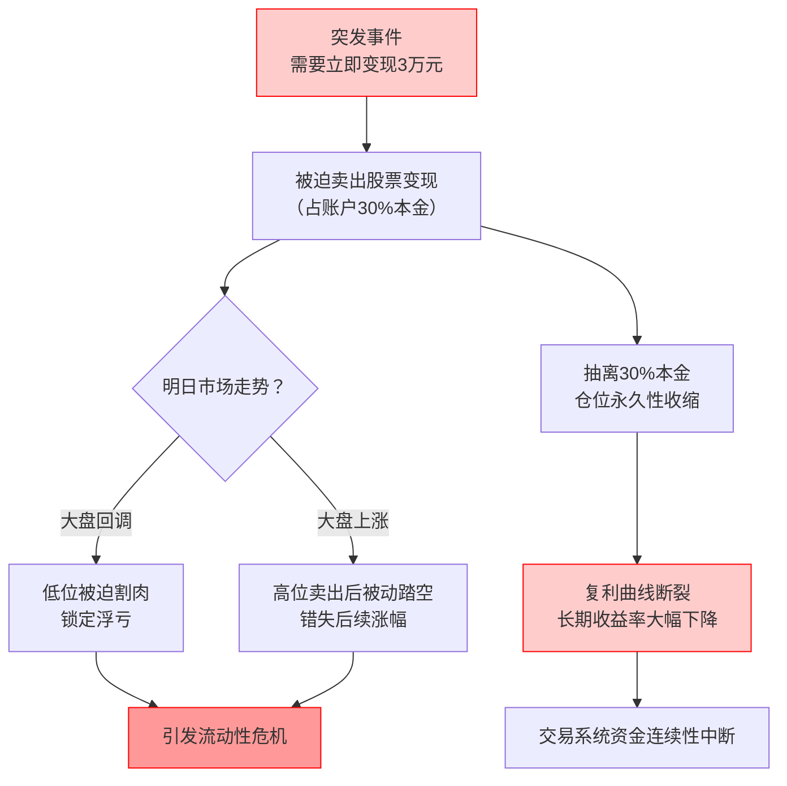
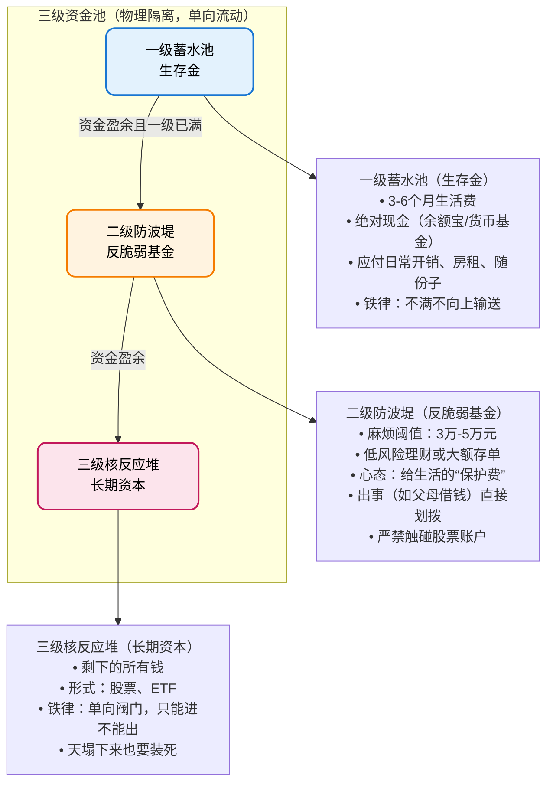

import { Aside } from 'astro-pure/user'
import { CardList } from 'astro-pure/user'
import { Collapse } from 'astro-pure/user'

> 亲情重要吗？重要也不重要。金钱重要吗？重要也不重要。
无论你的交易系统多么精密，平静似水（Be Water），才是抵抗人生无常的终极杠杆。
## 0x0 引言
投资圈有一句被嚼烂的话：“交易反人性”。

通常认为，**反人性是指由于贪婪和恐惧而无法拿住股票**。但最近发生的一件事让我意识到，对于我们这些试图通过交易改变命运的普通人而言，真正的“反人性”在于：

<Aside>**理性的复利曲线，可能无法兼容感性的人类生活。**</Aside>
当我自以为建立了一套完美的交易系统，正准备依靠时间杠杆撬动财富自由时，一通突如其来的电话让我意识到：阻碍普通人跨越阶层的，往往不是选股能力，而是生活中无处不在的 **“系统性硬耦”** 。

## 0x1 本金即安全感

今天父亲打来电话，这很罕见。
事情很老套：**他背着母亲借钱给别人赚利息，现在为了平息家庭矛盾，需要我支援3万块填坑。甚至为了让我放心，还发来了借条。**

理性上，我知道这钱大概率不会丢，只是左口袋进右口袋。但在我的**财务逻辑**里，这是一场灾难。这3万块不是躺在银行卡里的闲钱，它是我交易系统里的核心燃料（Capital）。

对于一个满仓者，我明天就要被迫卖出股票变现，这就是一场典型的**流动性危机**（Liquidity Crisis）：
<Aside type='danger'>
- 如果明天大盘回调，我就是被迫割肉。
- 如果明天大盘上涨，我就是被动踏空。
</Aside>
更致命的是，这3万块代表了我当前**投资账户 30% 的本金**。

抽离30%的本金，意味着我的复利模型瞬间坍塌。普通人建立交易系统最难的不是技术，而是**资金的连续性**。

只有当一个人对未来有绝对确定的安全感时，他才敢定投；

但这通电话，精准地击碎了这种确定性。这是一个恶性循环：你越需要安全感，你越努力积累；但生活越是会在你积累的关键时刻，通过“亲情”或“意外”来收割你的安全感。

<Collapse title="点击查看【资金链断裂推演图】" mode="preview">

</Collapse>

## 0x2 消费的隐形损耗

这种无力感不仅来自突发事件，更来自日常的**财务熵增**。

自诩在一线城市拿着高薪，过着低欲望生活，我以为2025年的积蓄会是一条漂亮的指数增长曲线。**但看着账户余额，我沉默了。**

虽然没有买车买房的大额支出，但每个月总有莫名其妙的“不可抗力”：**_一次朋友聚餐，一场突发的感冒，一件不得不换的电器。_** 这些看似微不足道的支出，就像船底的藤壶，悄无声息地吞噬着船速。

我们总是高估了自己的规划能力，低估了生活的混乱程度：

- 买房、结婚、生子是**计划内的回撤**；
- 而意外、疾病、甚至父亲的一通电话，是**计划外的崩盘**。

痛苦的根源在于：我们将**生活系统**和**投资系统**发生了**硬耦合（Hard Coupling）**。只要生活一震动，投资系统就崩塌。

## 0x3 建立三级缓冲

既然无法预测意外，我们必须在系统层面进行**解耦（Decoupling）**。

现在的我，钱只有两种状态：“花的”和“投的”。这太脆弱了。我需要建立一套物理隔离的**三级资金池**，作为防御生活撞击的防波堤：

<CardList title='建立三级资金池（点击查看）' mode="preview" list={
  [
    { 
      title: '1. 一级蓄水池（生存金）', 
      children: [
        { title: '【定义】：3-6个月的生活费（绝对现金，放余额宝/货币基金）。' },
        { title: '【作用】：应付日常开销、房租、随份子。' },
        { title: '【铁律】：这个池子不满，绝对不向上一级输送资金。' }
      ] 
    },
    { 
      title: '2. 二级防波堤（反脆弱基金）', 
      children: [
        { title: '这是我，也是大多数年轻人最缺失的一环。' },
        { title: '【定义】：设定一个“麻烦阈值”，例如 3万-5万元。' },
        { title: '【形式】：低风险理财或大额存单。' },
        { title: '【心态】：这笔钱在逻辑上不属于我，它是给生活这个“混蛋”交的保护费。如果一年没出事，那就是我赚了；如果出事了（如父亲借钱），直接从这里划拨，严禁触碰股票账户。' }
      ] 
    },
    { 
      title: '3. 三级核反应堆（长期资本）', 
      children: [
        { title: '【定义】：剩下的所有钱。' },
        { title: '【形式】：股票、ETF。' },
        { title: '【铁律】：单向阀门。资金只能进，不能出。外界天塌下来，这笔钱也必须装死。' }
      ] 
    },
  ]
} collapse />

<Collapse title="点击查看【三级资金池推演图】" mode="preview">

</Collapse>

## 0x4 心态的建立

架构搭建完毕后，还需要软件层面的升级——**心态**。

是的，我此时此刻内心很焦虑：为了亲情而打破自己好不容易建立的规矩，值得吗？
<Aside type='caution' title='You should know it!'>**以后如果还发生这种事情的话，我的该如何抵抗？**</Aside>

但是我在素材里写了一句很粗俗但很痛的话：**“为了避免这种提前吃屎的行为……”**

如果意外注定发生，那么“为可能发生的意外而焦虑”，就是提前把屎吃了一遍。真正的意外发生时，你还得再吃一遍。这不仅无效，而且愚蠢。

我需要建立两道心理防火墙：

**1. 执行“完全减记”（Immediate Write-off）**：

对于亲人的借贷，不要把它记为“应收账款”，那只会让你每天陷入内耗。
正确做法：借出去的那一刻，在心里直接记为**支出/赠予**，资产负债表瞬间归零。如果他以后还了，那是意外之财（Windfall）；如果不还，这早在你的预料之中。

**2. 建立“高净值但低流动性”人设**：

为了防止未来的道德绑架，你需要建立一道社交防火墙。下次面对大额借钱需求，请执行**流动性熔断话术**：

> 爸，为了强制储蓄，我把钱都买了封闭期3年的定期理财。取出来要扣掉所有本金。我现在手里流动的只有几千块生活费。

<Aside>这不是撒谎，这是保护你投资系统不被外界情绪干扰的限流机制。</Aside>
