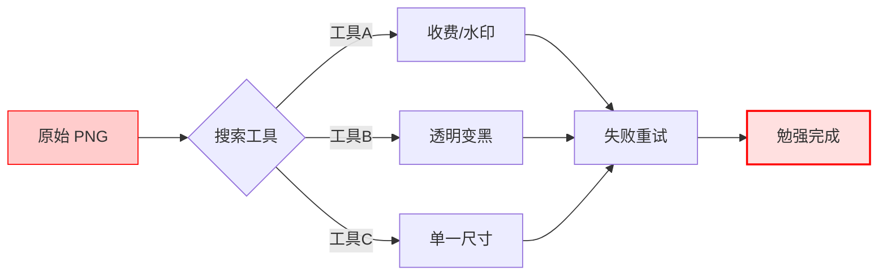
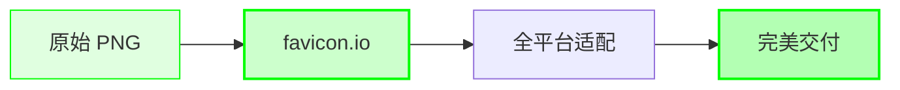
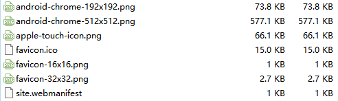

import { Aside } from 'astro-pure/user'
import { CardList } from 'astro-pure/user'
import { Collapse } from 'astro-pure/user'

> 寻找工具的时间，往往比使用工具的时间还要长。对于低频刚需，我们需要的不是更多选择，而是一个标准答案。
## 0x0 引言：低频操作的"时间黑洞"

在独立开发的漫长清单中，总有一些不起眼的小任务，像鞋子里的一粒沙子。

我刚刚完成了一个精美的网站架构，写完了复杂的后端逻辑，正准备收尾时，却卡在了最后一步：**上传 Favicon（网站图标）**。

这本该是一个 1 分钟的"动作"，却经常因为各种琐碎的技术壁垒变成 30 分钟的"折磨"：

<Aside type='caution'>
* **格式壁垒**：必须把 PNG/JPG 转成 `.ico`，但随便找个在线工具转换，透明背景往往变成了黑色色块。
* **碎片化灾难**：浏览器要 16x16，iPhone 主屏要 180x180，Android 又要 192x192，还有 Windows Tile...
* **重复造轮子**：因为一年可能只做一两次，每次都要重新 Google。结果往往是：点开前三个全是广告，第四个收费，第五个功能残缺。
</Aside>

这种"搜索+试错+修正"所消耗的认知资源，甚至远超你设计图标本身的时间。

**对于这种低频但刚需的操作，我们需要的不是"更多选择"，而是一个经过验证的"标准答案"。**

---

## 0x1 时间去哪了？

为什么我强烈建议将特定的工具固化在你的工作流中？让我们用逻辑图来审计一下**随机搜索流程与标准化流程**的效率差：

<Collapse title="点击查看【效率对比推演】" mode="preview">

**❌ 传统低效流程**（充满不确定性）：

**✅ 标准化流程**（确定性、一次完成）：

</Collapse>

左侧的流程充满了不确定性（Entropy），每一次点击都是一次赌博；而右侧的流程是线性的、确定的。

**高手的效率，往往来自于消灭这些不必要的微小决策。**

---

## 0x2 终极方案：favicon.io

对于 Favicon 的需求，我只推荐这一个工具。建议直接加入收藏夹，终结你未来的所有搜索动作。

**工具名称**：[favicon.io](https://favicon.io/)

这不是一个简单的转换器，它是一个**全平台的图标解决方案**。

<CardList title='核心优势审计' mode="preview" list={
  [
    {
      title: '1. 全自动环境适配',
      children: [
        { title: '它不仅仅生成 .ico。' },
        { title: '它会自动吐出 iOS (Touch Icon)、Android (Chrome)、Windows (Metro Tile)、macOS (Safari Pinned Tab) 等全套标准尺寸。' }
      ]
    },
    {
      title: '2. 代码级交付',
      children: [
        { title: '这是它最性感的地方。' },
        { title: '它不光给你一个图片压缩包，它会直接生成一整段标准的 `<link>` 和 `<meta>` 标签。你不需要去查文档"安卓图标用什么标签"，直接复制粘贴即可。' }
      ]
    },
    {
      title: '3. 极简主义',
      children: [
        { title: '免费、无弹窗、无强制注册。' },
        { title: '这是一个尊重用户时间的工具该有的样子。' }
      ]
    }
  ]
} collapse />

**标准操作 SOP：**
1.  **Upload**: 上传一张高清 PNG（建议 512x512 以上）。
2.  **Config**: 在可视化界面微调不同平台的显示效果（背景色、边距）。
3.  **Generate**: 点击生成，下载资源包，复制 HTML 代码。

---

## 0x3 深度思考：工具的"静默 BGM 效应"

我之所以专门为这个小工具写一笔，是因为它完美诠释了我对好产品的定义：**"静默 BGM"（背景音乐）**。

<Aside>
如果你不刻意去听，你根本不会发现 BGM 的存在；但如果它消失了，或者配错了，整个电影场景的氛围感瞬间就会崩塌。
</Aside>

好用的开发工具也是如此：
* **它不抢戏**：它没有花哨的 UI，没有强行刷存在感的功能。
* **它不打扰**：它不需要你投入额外的学习成本。
* **关键时刻在场**：当且仅当你需要它的那一瞬间，它能用最快速度解决问题，让你的开发场景变得流畅、有格调。

我们在构建自己的系统时，应该追求收集更多这样的"静默 BGM"。

收藏它，不仅仅是为了保存一个网址，而是为了在下一次面临繁琐时，能自信地省去那些无意义的甄别时间，把宝贵的脑力留给真正值得的代码。

> 温馨提示，不仅支持图片，还支持字符和Emoji。
