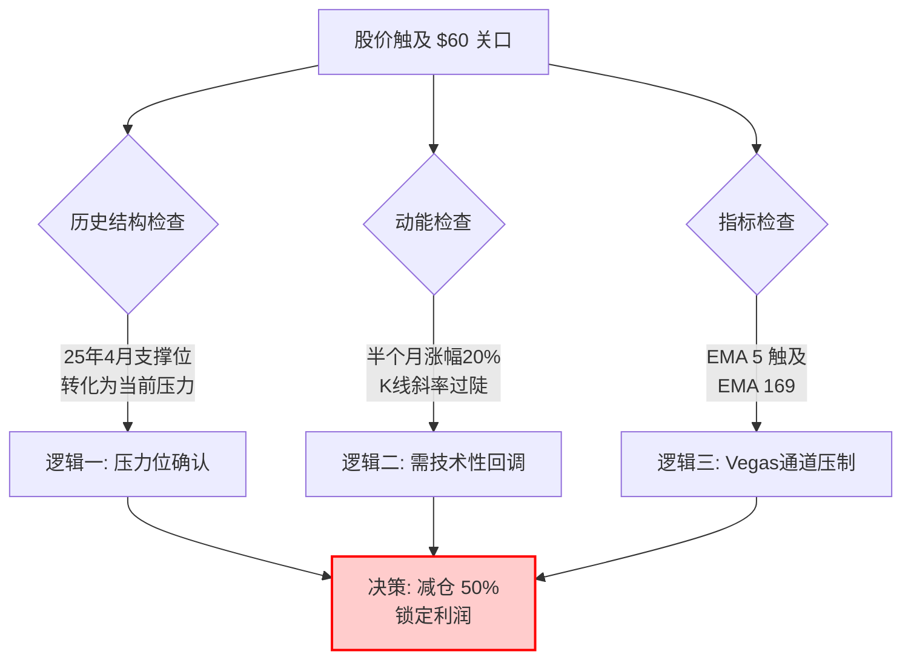

import { Aside } from 'astro-pure/user'
import { CardList } from 'astro-pure/user'
import { Collapse } from 'astro-pure/user'

> 会买的是徒弟，会卖的是师傅。

## 0x0 贪婪与节奏的博弈

在投资的世界里，最难的决策往往不是在低谷时坚守，而是在高歌猛进时撤退。

诺和诺德（Novo Nordisk），作为全球减肥药的双寡头之一，无疑是这几年美股最耀眼的明星。经历了前段时间的深度回调与漫长筑底后，它终于迎来了爆发。

我在 **2025年12月12日** 左侧建仓，成本 **\$40.45**。
今天，**2026年1月9日**，股价冲上 **\$60.17**。

看着账户里漂亮的浮盈，多巴胺在疯狂分泌，本能告诉我："拿着，还能涨。"但理性的交易系统却亮起了黄灯。

最终，我选择逆着情绪，按下了**减仓50%的按钮**。

<Aside> 这不是离场，这是为了防止利润回撤而进行的战术性防御。 </Aside>

## 0x1 为什么要"下车"？

很多人认为，只要公司基本面没变，就应该永久持有。但在我的交易体系中，**价格的结构（Structure）优先于情绪**。

这次在 \$60 关口减仓，并非一时兴起，而是基于三个维度的逻辑共振：

### 1. 结构面：筹码的记忆
\$60 不仅仅是一个整数关口，它是一个充满"血泪"的战场。
* **前世（支撑）：** 2025年4月，这里曾是强有力的支撑位。
* **今生（压力）：** 2025年10月，股价试图反攻此地，宣告失败。
* **原理：** 曾经的支撑位跌破后，会转化为最沉重的压力位（Resistance）。那里套牢了无数等待解套的冤魂，一旦价格触及，抛压将如期而至。

### 2. 动能面：乖离率过大
从12月18日启动至今，短短半个月，股价涨幅已近 **20%**。K线的斜率陡峭得像是在攀岩。
物理学告诉我们，垂直的攀升不可持续。这种急涨必然需要一个"平台期"来消化获利盘，要么横盘震荡，要么回调确认。

### 3. 指标面：Vegas通道的压制
在 Vegas 隧道交易法中，短期均线（EMA 5）虽然上穿，但正如一头撞上了长期均线（EMA 169）的铁板。这是动能衰竭的典型信号。

<Collapse title="点击查看【减仓逻辑推演图】" mode="preview">

</Collapse>

## 0x2 市场验证与宏观共振

就在我以 **\$60.17** 完成减仓后，市场给出了即时的反馈。

当天收盘，诺和诺德回落至 **\$58.8**。虽然只是微跌，但这根带着上影线的K线，初步验证了 \$60 上方抛压的沉重。

与此同时，宏观环境也在配合这次回调：
美国最新的就业数据优于预期。这对经济是好事，但对股市是坏事——强劲的就业意味着美联储降息的预期降温。在大盘全线收绿的背景下，处于高位的诺和诺德很难独善其身。

## 0x3 下一步剧本：回马枪

我减仓，并不代表我看空。相反，是因为**太看好**，所以才希望能以更低的价格拿回筹码。

诺和诺德的基本面依然硬朗：
1.  **护城河**：减肥药领域的双寡头地位稳固。
2.  **管线**：新药研发利好频出。
3.  **估值**：即便反弹后，仍处于历史相对低位。

<CardList title='未来交易计划 (Trade Plan)' mode="preview" list={
  [
    {
      title: '保留仓位：50%',
      children: [
        { title: '底仓不动，防止市场非理性逼空，避免踏空后续主升浪。' }
      ]
    },
    {
      title: '回接目标：\$53.8',
      children: [
        { title: '依据：这是最近一个明显的筹码密集峰（Chip Peak）。' },
        { title: '逻辑：如果回调至此，之前的阻力将转化为支撑，是极佳的"倒车接人"点位。' }
      ]
    },
    {
      title: '下一目标：\$69',
      children: [
        { title: '如果行情延续，突破\$60后的下一个强阻力位看至\$69，届时将进行第二次减仓。' }
      ]
    }
  ]
} collapse />

---

**最后的思考**

这次操作再次提醒我：交易不是预测未来，而是**应对当下**。

当价格撞上墙（压力位）时，不要去赌它能穿墙而过，先退后一步，保护好自己的筹码。如果它真的破墙而去了，我手里的底仓依然在；如果它回头了，我有足够的现金在低位等它。

这，就是节奏。
