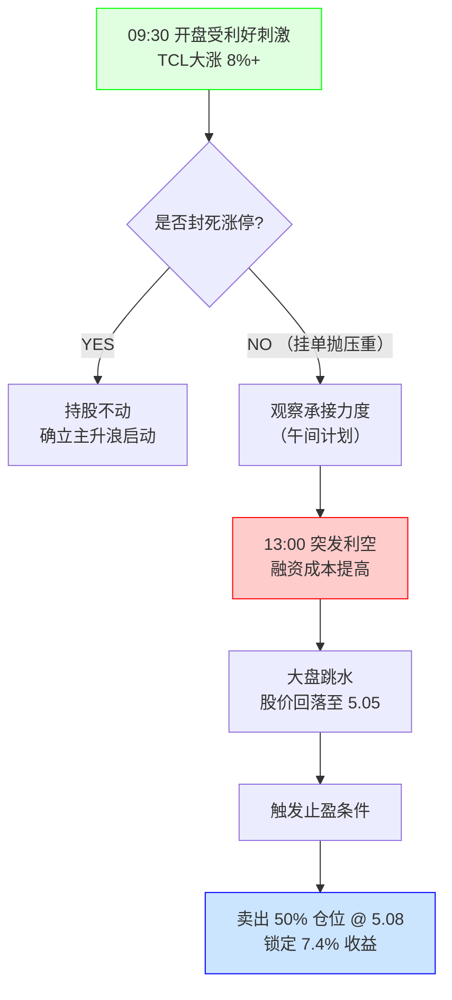

import { Aside } from 'astro-pure/user'
import { CardList } from 'astro-pure/user'
import { Collapse } from 'astro-pure/user'

> 市场永远在预支未来。当所有人都在为确定的过去（财报）欢呼时，交易者必须盯着不确定的当下（盘口）。

## 0x0 多巴胺与冷水澡

今天上午的开盘，是一场典型的**多巴胺盛宴**。

TCL科技（000100）高开高走，一度飙升近 **9%**。我看着屏幕上红得发紫的数字，以及几天前刚刚接回的筹码瞬间浮盈 **7.4%**，这种“精准抄底+利好暴击”的剧本，足以让任何投资者的肾上腺素飙升。

**催化剂是一份漂亮的成绩单：** 昨晚公告显示，2025年企业营收预期强劲，TCL华星净利润超80亿元。

这是一个绝对的基本面利好。按理说，我应该躺在功劳簿上数钱。但在午饭时间的短暂兴奋后，我的直觉（以及那该死的经验）开始泼冷水：

1.  **利好出尽即利空**：股价已经在早盘反应了这一消息，但迟迟未能封死涨停。
2.  **盘口语言**：涨停价位上挂着巨量的卖单，说明有大资金借着利好在“派发”。
3.  **似曾相识**：这种“冲高回落”的剧本，上一周才刚刚上演。

下午，A股突然传出“收紧保证金”的利空消息，大盘跳水。早盘的犹豫变成了下午的决绝——**我按下了卖出键。**

## 0x1 TCL科技：从预期到落袋

这是一次教科书式的**预期管理**操作。

**复盘逻辑链：**
* **买入点**：5天前（1月9日），在上一轮家庭变故后的理性回归，此时是基于技术面超跌的博弈。
* **爆发点**：今天（1月14日），基于基本面消息（80亿利润）的情绪宣泄。
* **卖出点**：下午盘中，价格跌破 5.08 RMB。

我选择了**止盈 50%**。

<Aside type='tip'>
为什么不全卖？因为趋势尚未完全坏死，保留底仓是防止踏空后续的“主升浪”。
为什么不全留？因为未能封板就是弱势表现，叠加下午的宏观利空，必须锁定这 7.4% 的利润，防止“过山车”惨剧。
</Aside>

<Collapse title="点击查看【日内交易决策树】" mode="preview">

</Collapse>

这也印证了我一直以来的观点：**由于我们无法预知下午会有什么利空，所以当上午市场给出了溢价时，先拿走一部分属于你的钱，永远没错。**

> 只要赚钱了，就不臭。

## 0x2 恒生指数：杠杆是时间的敌人

如果说TCL的操作是战术层面的“止盈”，那么下午清仓**两倍做多恒生指数**，则是战略层面的**降维**。

这笔交易同样盈利颇丰，从底部反弹已获利 10%+。但我清仓的核心逻辑并非因为它涨不动了，而是因为**时间成本**。

在融资账户里，杠杆是有隐形税收的。年化 8% 的融资成本，意味着：
* 如果市场横盘，我在亏钱。
* 如果市场微涨，我只是打平。
* 只有市场大涨，我才能跑赢成本。

<CardList title='清仓逻辑审计' mode="preview" list={
  [
    {
      title: '1. 阻力位确认',
      children: [
        { title: '恒指已经反弹至前期高点（箱体上沿），大概率进入震荡消化期。' }
      ]
    },
    {
      title: '2. 摩擦成本（Friction Cost）',
      children: [
        { title: '在震荡市中持有杠杆是愚蠢的。时间是杠杆的敌人，却是现金的朋友。' },
        { title: '为了不确定的鱼尾行情，支付确定的高额利息，这笔账算不过来。' }
      ]
    },
    {
      title: '3. 宏观共振',
      children: [
        { title: 'A股融资成本提高的消息，本质上是在收紧流动性。港股作为离岸市场，对流动性极其敏感。' }
      ]
    }
  ]
} collapse />

## 0x3 美股的犹豫与“空仓的智慧”

现在，压力给到了美股账户。

逻辑上，我也想降低美股的杠杆。目前美股处于一个**高位箱体震荡**的尴尬区间：
* **看多**：似乎蓄势待发，随时可能突破前高。
* **看空**：处于箱体上沿，盈亏比极差，且高利率环境像悬在头顶的剑。

这种**将涨未涨、似跌非跌**的状态，是最考验人性的。

但我决定先**再观察一下**。

在看不清方向的时候，不要强行操作。与其在震荡中被双向打脸，不如降低预期，等待市场走出明确的方向。

---

## 0x4 总结：此时此刻，现金为王

今天的操作可以总结为一个关键词：**收缩**。

1.  **TCL科技**：借利好收缩仓位，锁定利润。
2.  **恒生指数**：借高点收缩杠杆，规避成本。
3.  **整体策略**：从激进的进攻态势，转为防御性的“蹲守”。

<Aside>
投资不是比谁在顺风局赚得多，而是比谁在逆风局活得久。
</Aside>

当宏观环境开始收紧（融资成本提高），当个股利好无法推动涨停，市场其实已经在悄悄告诉你：**“风要停了，先把翅膀收起来。”**

今天的我，比昨天少了些筹码，但多了几分睡个好觉的底气。
