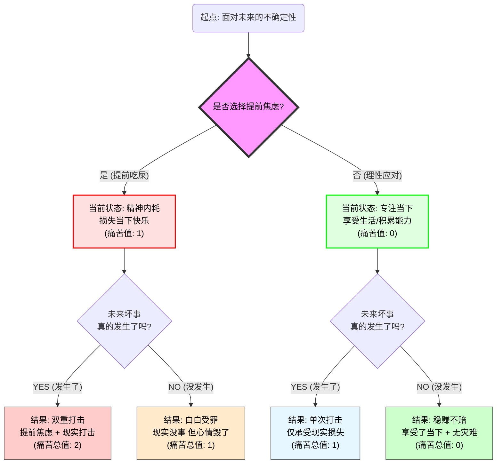
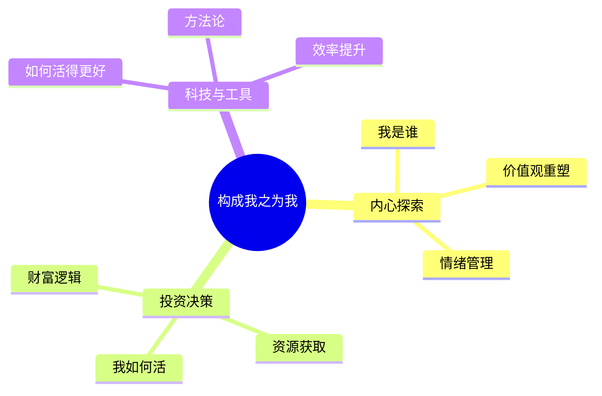

import { Aside } from 'astro-pure/user'
import { CardList } from 'astro-pure/user'
import { Collapse } from 'astro-pure/user'

## 0x0 在“罗马”与“洞穴”之间

**一直以来，我都在寻找一种完美的活法：**

<Aside> 不需要为钱折腰，不需要看人脸色，也不需要为不确定的未来担惊受怕。 </Aside>

这似乎是所有20多岁年轻人的共同症候群。

我们羡慕那些出生在“罗马”的幸运儿，却忘了自己并没有生在贫民窟；我们羡慕别人的豁达，却在深夜里独自反刍焦虑。

为了那个名为“财富自由”的目标，我曾在这个喧嚣的世界里，把自己关进孤独的“洞穴”。

我告诉自己，这一切都是为了家人，为了未来。但在无数个辗转反侧的失眠夜后，我开始反问自己：**这真的值得吗？**

---

## 0x1 被称为“提前吃屎”的各种焦虑

在过去的几年里，我最大的精神内耗来源只有一个字：**钱**。

虽然当下的积蓄足以支撑生活，但我的大脑总是不由自主地快进到未来——_如果失业了怎么办？如果家人生病了怎么办？如果经济崩盘了怎么办？_

我曾以为这叫**未雨绸缪**，是成熟的表现。但随着对内心世界的逻辑推演，我发现这本质上是一种极其愚蠢的行为模式，是**提前吃屎**。

> 提前吃屎理论：
未来确实可能发生糟糕的事情（吃屎）。但如果你因为担心未来而现在就陷入痛苦，那你不仅没有阻止那件事发生，反而是在它发生之前，已经在精神上预先体验了一遍痛苦。

<Aside type='danger'>**结果是：你吃了两遍屎。**</Aside>

让我们用逻辑图来看清这个死循环：

<Collapse title="点击查看" mode="preview">

</Collapse>

**结论非常冷酷：** 焦虑并不能阻止黑天鹅事件的发生。我们唯一能掌控的，是不让未来的阴影吞噬现在的阳光。哪怕未来真的会崩塌，我也要在崩塌前的那一秒，尽情享受现在的平静。

---

## 0x2 人生是一场“体验游戏”

当我们从金钱的焦虑中抽离，把视角拉高到宇宙的维度，所谓的“成功”与“失败”就变得微不足道了。

_富裕是一种人生，贫穷是另一种人生；权力在手是一种剧本，默默无闻是另一种剧本。在这个巨大的沙盒游戏中，并没有哪一种设定绝对优于另一种。_

<Aside>**它们都只是“体验”。**</Aside>

这便是我现在的核心哲学：

- **不追求世俗的“好”：** 哪怕路途颠簸，哪怕世俗眼光中的“差”，只要我在过程中感受到了生命的质感，那就是值得的。如果在这个过程中能够帮助到一些人，那便是万幸。
- **记录即意义：** 我不再执着于是否有观众，是否有回报。我愿意用文字去梳理、去记录。如果未来我有幸回看，能对自己说一句“此生无憾”，足矣。

与其在焦虑中追求一个终点，不如把注意力放在路边的风景上。

---

## 0x3 如何活得更好

> 失眠带来的焦虑，比失眠本身更可怕。

为了对抗这种无谓的虚无，我决定建立这个平台。这里不是情感垃圾桶，而是一个 **“理性与感性交织的实验室”**。

作为一个热衷于透过现象看本质的人，我将我的人生探索拆解为三个有机的部分，这也将是本博客未来的三大内容支柱：

1. **我是谁 (Who am I) - 内心探索：**
    - 探索心理学、哲学与自我认知。
    - 目的：构建强大的内核，在混乱的世界中找到平静，并尽力帮助别人。
2. **我如何活 (How to Live) - 投资与决策：**
    - 分享投资逻辑、财富观念与实战思考。
    - 目的：用理性的资源配置，换取选择的自由。
3. **我如何活得更好 (How to Live Better) - 科技与工具：**
    - 分享高效软件、实用网站与科技技巧。
    - 目的：利用工具提升效率，腾出更多时间去“体验”生命。

这三者的逻辑关系如下：

<Collapse title="点击查看" mode="preview">

</Collapse>
---

## 0x4 援以世人，或是自渡

这可能不算是一个华丽的舞台，甚至可能没有掌声。但我依然选择记录，选择分享。

如果我的逻辑梳理能帮你理清哪怕一团乱麻，如果我的“体验主义”能让你在焦虑的深夜感到一丝宽慰，那便是万大的荣幸。

<Aside type="tip">

从今天起，当你再次为未来感到焦虑时，请停下来问自己一句：**“我现在是不是在提前吃屎？”**
如果是，请深呼吸，回到当下，去拥抱你身边的人，或者去解决一个手边具体的小问题。
</Aside>

**欢迎来到我的世界，让我们一起理性地在这个疯狂的世界里，寻找平静。**
