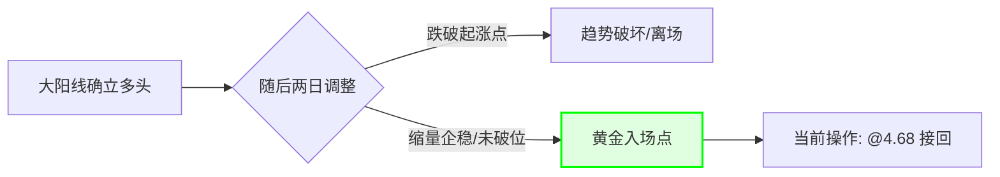

import { Aside } from 'astro-pure/user'
import { CardList } from 'astro-pure/user'
import { Collapse } from 'astro-pure/user'

> 所有的交易错误中,最昂贵的不是亏损,而是让上一笔交易的"情绪幽灵"缠绕在当下的决策中。

## 0x0 逻辑归位

在前一篇文章中,我因为家庭变故(父亲的债务)被迫破坏了交易的一致性,清仓了 TCL 科技。那是一次典型的"生活入侵交易"。

仅仅两天后,我选择重新入场。

表面上看,这像是一个反复无常的韭菜行为:高位卖出,跌了一点又买回来,似乎在折腾手续费。但从**系统重构**的角度看,这是必须的一步。

上一笔交易是**"受污染的"**——它背负了家庭责任、愤怒和无奈。
这一笔交易是**"纯净的"**——它完全基于图表、逻辑和概率。

## 0x1 技术面:大阳线后的"黄金坑"

**标的**:TCL科技 (000100)
**操作**:买入 10,000 RMB
**成本**:¥4.68 (收盘 ¥4.64)

**入场逻辑解析:**

1.  **趋势未破**:前两天的大阴线虽然凶狠,但恰好回撤吞噬了前几日那根大阳线的涨幅,却**未跌破阳线起涨点**。在多头趋势中,这往往是良性的"洗盘"。
2.  **股性套利**:TCL 这只票的"股性"极其磨人(Grinding)。主力习惯在拉升后进行阴跌洗盘,利用散户的恐慌收集筹码。此时的下跌,反而是系统内的买点。
3.  **盈亏比优秀**:月线级别上升通道依然完整,目标直指通道上沿。

<Collapse title="点击查看【技术面推演】" mode="preview">

</Collapse>

## 0x2 交易计划 (Trade Plan)

这是我重新建立秩序的基石。不再有"父亲的借条",只有冷冰冰的数字。

<CardList title='策略参数' mode="preview" list={
  [
    {
      title: '第一止损位:¥4.57',
      children: [
        { title: '依据:12日均线支撑。' },
        { title: '逻辑:短期趋势的生命线,跌破意味着洗盘力度超预期。' }
      ]
    },
    {
      title: '第二止损位(硬防守):¥4.42',
      children: [
        { title: '依据:120日半年线 + 筹码峰下沿(¥4.44)。' },
        { title: '逻辑:¥4.44是一个巨大的筹码密集区,跌破此位置意味着主力弃守,必须无条件离场。' }
      ]
    },
    {
      title: '止盈目标:¥5.60 - ¥6.00',
      children: [
        { title: '依据:月线级别上升通道上沿。' },
        { title: '逻辑:用不到 5% 的止损空间,博取 20%+ 的上涨空间。' }
      ]
    }
  ]
} collapse />

## 0x3 心理账户的"格式化"

有人可能会问:*"既然看好,前两天为什么要清仓?这不是多此一举吗?"*

除了避开了这两天近 **6%** 的回撤(这本身就是一笔巨大的超额收益),更重要的是完成了**心理账户(Mental Accounting)的重置**。

如果我不卖出,这两天的下跌会让我联想到:"看,都是因为借钱给家里,导致我心态不稳,看着资产缩水。"我会陷入无尽的内耗。

而现在,我清空了之前的因果。

这是一笔全新的交易。它没有历史包袱,没有家庭恩怨。**我用一次手续费的代价,买回了交易系统的纯粹性。**

<Aside type='tip'>
**交易哲学:**
有时候,承认自己"蠢"一点,把复杂的连贯剧本切断,变成一个个独立的、可控的战术单元,反而是普通人对抗混乱生活的最佳策略。
</Aside>
