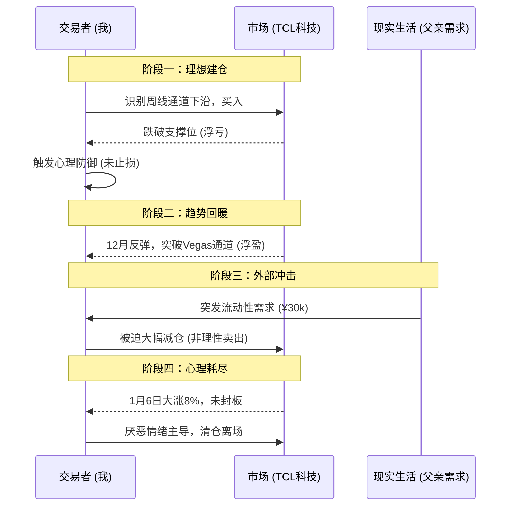

import { Aside } from 'astro-pure/user'
import { CardList } from 'astro-pure/user'
import { Collapse } from 'astro-pure/user'

> 真实的投资世界里，击败你的往往不是复杂的数学模型，而是突如其来的生活账单和日积月累的心理疲惫。

## 0x0 引言

我们常说，把人生看作一场体验。而金融市场，则是这场体验中浓度最高、反馈最直接的竞技场。

在这里，我们试图用最理性的逻辑、最冰冷的技术指标去驾驭最疯狂的人性贪婪与恐惧。我们渴望通过“投资思维”来拆解生活的焦虑，追求一种理性的平静。

**然而，现实往往会给我们一记响亮的耳光。**

当完美的交易计划遇上突如其来的生活琐事，当屏幕上的数字必须转化为支付账单的现金时，所谓的“定力”与“格局”常常瞬间崩塌。

今天，我想复盘一笔并不完美的交易——TCL科技（2025.9 - 2026.1）。这不仅仅是一次技术分析的演练，更是一次关于**逻辑模型如何由于“外部冲击”和“心理损耗”而变形的真实记录**。

<Aside>我们需要祛魅的，不仅是市场，更是我们对自己掌控力的幻想。</Aside>

## 0x1 技术形态的诱惑

故事的开始总是充满了理性的光辉。

2025年9月，我将目光投向了TCL科技。

在我的交易系统中，它此时展现出了极具吸引力的形态：股价触及了周线和月线级别上升通道的下沿。在经典的图表派理论中，这是一个教科书级别的潜在反弹点（Buying the Dip）。

带着对模型的信任，我开始建仓。

然而，市场很快给我上了一课。预期的反弹并未如期而至，股价反而跌破了被视为“铁底”的上升通道下沿。

**这里出现了第一个认知摩擦点：**

按照严格的纪律，破位即应止损。但我陷入了典型的**禀赋效应**——_“位置已经很低了”、“企业还在盈利”_。我用基本面的借口，掩盖了技术面执行力的缺失。

幸运的是，市场在经历了两次痛苦的下探后，于12月迎来了转机。5日均线上穿Vegas通道上沿，多头排列形成，似乎验证了我“死扛”的正确性。

## 0x2 流动性危机

如果故事到这里结束，这可能又是一篇歌颂“坚持与信仰”的廉价鸡汤。但真实的生活，永远比剧本更狗血。

就在账户浮盈，趋势向好的关键时刻，一个完全处于交易系统之外的变量出现了——**我的父亲急需3万元现金。**

当时我的TCL持仓市值约为4万元。这是一个极其尴尬的时刻：你明知道手中的资产处于上升通道，你明知道此刻卖出是反逻辑的，但现实的流动性压力迫使你必须做出选择。

结果是残酷的：**我被迫减仓3万元，占总仓位的75%。**

<Aside type='danger'>
这次减仓与市场分析毫无关系，它纯粹是生活对投资的一次**“降维打击”**。它赤裸裸地揭示了一个事实：任何一笔意外的生活支出，都可能成为强制触发的“物理止损线”。
</Aside>

在这场算法与现实的博弈中，现实完胜。

<Collapse title="点击查看【交易逻辑崩塌推演】" mode="preview">

</Collapse>

## 0x3 心理损耗与“磨人”的艺术

剩下的几千元仓位，在2026年1月6日迎来了最后的结局。

当日，TCL科技一度大涨8%，接近涨停。但在尾盘，它并未封死涨停板。基于对这只股票长期以来“股性”的观察——盘子大、主力操作风格猥琐、喜欢挂大卖单压盘、K线常带上影线、习惯“阴跌加大阳线”的反复震荡模式——我做出了清仓的决定。

这一次的卖出，不再是被迫，但也谈不上完全理性。它更多源于一种**心理上的疲惫感**。

我称之为**心理损耗（Psychological Attrition）**。

这只股票太“磨人”了。它缺乏那种势如破竹的“大格局”，反而充满了小家子气的反复收割。

虽然事后看基本面，高负债、重投资、长回报周期以及潜在的融资风险确实是隐患，但在那一刻，促使我点击卖出按钮的，是对这种折磨人的交易模式的厌倦。

哪怕它之后还会涨，我也不想再参与了。我选择拿回确定的收益，换取内心的平静。

## 0x4 深度反思：我们在交易什么？

复盘这笔交易，如果你只看结果，或许还算一笔赚钱的买卖。但过程却充满了妥协、意外和情绪化决策。

它给我带来了几个深刻的启示：

<CardList title='核心反思' mode="preview" list={
  [
    {
      title: '1. 流动性是最高级别的“基本面”',
      children: [
        { title: '不要用你短期内可能急需的钱去投资。' },
        { title: '无论图表多么完美，生活的紧急账单永远拥有最高优先级。' }
      ]
    },
    {
      title: '2. 承认“心理资本”的有限性',
      children: [
        { title: '我们不是冷冰冰的AI。' },
        { title: '长时间持有“磨人”的股票，会极大地消耗心理资本。当资本耗尽，理智也就下线了。' }
      ]
    },
    {
      title: '3. 祛魅“坚持”',
      children: [
        { title: '有时候，“没止损扛过来了”并不是因为英明，仅仅是因为运气好。' },
        { title: '不要把运气当作实力。' }
      ]
    }
  ]
} collapse />

<Aside type='tip' title='Actionable Insight'>
**审视你的“紧急备用金”**：
在进行任何权益类投资之前，请确保你预留了至少覆盖3-6个月生活开支的现金。这笔钱不是用来投资的，而是用来作为你投资组合的“防波堤”，防止生活中的黑天鹅事件迫使你在错误的时间卖出正确的资产。
</Aside>