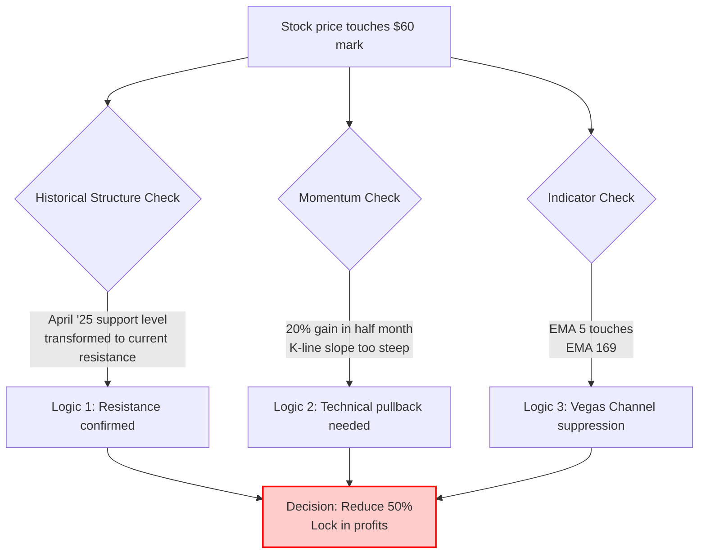

import { Aside } from 'astro-pure/user'
import { CardList } from 'astro-pure/user'
import { Collapse } from 'astro-pure/user'

> Knowing when to buy makes you an apprentice; knowing when to sell makes you a master.

## 0x0 The Game Between Greed and Rhythm

In the world of investing, the hardest decision is often not holding tight in the valleys, but retreating when things are going great.

Novo Nordisk, as one of the two oligopolies in global weight-loss drugs, has undoubtedly been one of the brightest stars in US stocks in recent years. After experiencing a deep correction and lengthy base-building, it finally ushered in an explosion.

I built my position on the left side on **December 12, 2025**, with a cost basis of **$40.45**.
Today, **January 9, 2026**, the stock price surged to **$60.17**.

Looking at the beautiful floating profit in my account, dopamine was secreting wildly, and instinct told me: "Hold on, it can still rise." But the rational trading system lit up a yellow light.

In the end, I chose to go against my emotions and pressed **the button to reduce my position by 50%**.

<Aside> This is not an exit, but a tactical defense to prevent profit retracement. </Aside>

## 0x1 Why "Get Off the Bus"?

Many people believe that as long as a company's fundamentals haven't changed, you should hold forever. But in my trading system, **the structure of price takes priority over emotion**.

This reduction at the $60 mark was not impulsive, but based on the resonance of logic across three dimensions:

### 1. Structural Level: The Memory of Chips
$60 is not just a round number; it's a battlefield full of "blood and tears."
* **Past life (Support):** In April 2025, this was a strong support level.
* **Present life (Resistance):** In October 2025, the stock price attempted to counterattack this area and failed.
* **Principle:** Once a former support level is broken, it transforms into the heaviest resistance. Trapped souls waiting to break even reside there, and once the price touches it, selling pressure will arrive as expected.

### 2. Momentum Level: Excessive Deviation
From the launch on December 18 to now, in just half a month, the stock price has risen nearly **20%**. The slope of the K-line is as steep as rock climbing.
Physics tells us that vertical climbs are unsustainable. Such a sharp rise inevitably needs a "platform period" to digest profit-taking, either through sideways consolidation or pullback confirmation.

### 3. Indicator Level: Vegas Channel Suppression
In the Vegas tunnel trading method, although the short-term moving average (EMA 5) crossed above, it's hitting the iron plate of the long-term moving average (EMA 169). This is a typical signal of momentum exhaustion.

<Collapse title="Click to view【Position Reduction Logic Deduction Diagram】" mode="preview">

</Collapse>

## 0x2 Market Validation and Macro Resonance

Right after I completed the position reduction at **$60.17**, the market gave immediate feedback.

At the close that day, Novo Nordisk fell back to **$58.8**. Although only a slight decline, this K-line with an upper shadow initially verified the heavy selling pressure above $60.

At the same time, the macro environment was also coordinating this pullback:
The latest US employment data exceeded expectations. This is good news for the economy but bad news for the stock market—strong employment means cooling expectations for Fed rate cuts. Against the backdrop of the overall market closing in red, Novo Nordisk at high levels found it hard to remain unscathed.

## 0x3 Next Script: Return Move

My position reduction does not mean I'm bearish. On the contrary, it's because I'm **too bullish** that I hope to get chips back at a lower price.

Novo Nordisk's fundamentals remain solid:
1. **Moat**: The duopoly position in the weight-loss drug field is stable.
2. **Pipeline**: New drug R&D continues to deliver positive news.
3. **Valuation**: Even after the rebound, it's still at a relatively low historical level.

<CardList title='Future Trading Plan (Trade Plan)' mode="preview" list={
  [
    {
      title: 'Retained Position: 50%',
      children: [
        { title: 'Base position unchanged, to prevent market from irrationally squeezing shorts and avoid missing subsequent main uptrend.' }
      ]
    },
    {
      title: 'Re-entry Target: $53.8',
      children: [
        { title: 'Basis: This is a recent obvious chip concentration peak (Chip Peak).' },
        { title: 'Logic: If it pulls back here, previous resistance will transform into support, making it an excellent "backing up to pick up passengers" point.' }
      ]
    },
    {
      title: 'Next Target: $69',
      children: [
        { title: 'If the trend continues, after breaking through $60, the next strong resistance level looks to $69, at which point I will conduct the second position reduction.' }
      ]
    }
  ]
} collapse />

---

**Final Thoughts**

This operation reminds me once again: trading is not about predicting the future, but **responding to the present**.

When price hits a wall (resistance level), don't bet it can break through—step back first and protect your chips. If it really breaks through, the base position I hold is still there; if it turns back, I have enough cash to wait for it at lower levels.

This is rhythm.
