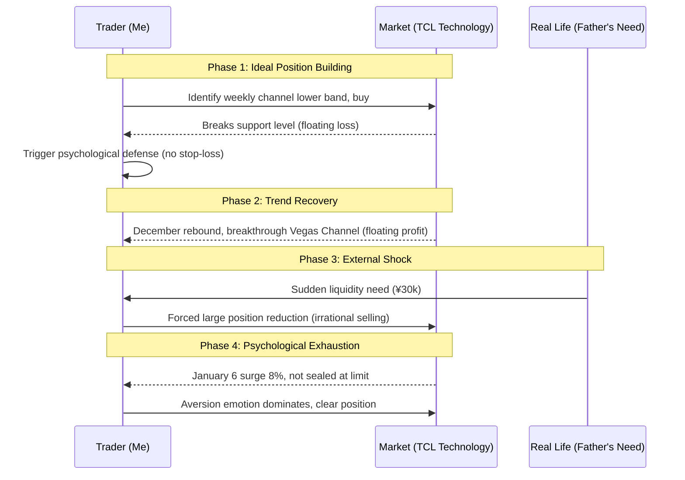

import { Aside } from 'astro-pure/user'
import { CardList } from 'astro-pure/user'
import { Collapse } from 'astro-pure/user'

> In the real world of investing, what defeats you is often not complex mathematical models, but unexpected bills and accumulated psychological fatigue.

## 0x0 Introduction

We often say that life is an experience. And the financial markets are the arena with the highest concentration and most direct feedback in this experience.

Here, we try to use the most rational logic and the coldest technical indicators to control the craziest human greed and fear. We long to deconstruct life's anxiety through "investment thinking" and pursue a rational calm.

**However, reality often slaps us hard in the face.**

When a perfect trading plan meets unexpected life trivialities, when the numbers on the screen must be converted into cash to pay bills, the so-called "composure" and "big picture" often collapse instantly.

Today, I want to review a less-than-perfect trade—TCL Technology (Sep 2025 - Jan 2026). This is not just a technical analysis drill, but a real record of **how a logical model deforms due to "external shocks" and "psychological attrition"**.

<Aside>What we need to demystify is not only the market, but also our illusion of control over ourselves.</Aside>

## 0x1 The Temptation of Technical Patterns

The beginning of the story is always full of rational glory.

In September 2025, I turned my attention to TCL Technology.

In my trading system, it showed a very attractive pattern at the time: the stock price touched the lower boundary of the weekly and monthly uptrend channels. In classical chart theory, this is a textbook potential bounce point (Buying the Dip).

With trust in the model, I started building a position.

However, the market soon taught me a lesson. The expected rebound did not materialize as expected, and instead the stock price broke below what was considered an "iron bottom" of the uptrend channel.

**Here came the first cognitive friction point:**

According to strict discipline, a breakdown should trigger a stop-loss. But I fell into the classic **endowment effect**—_"the position is already very low"_, _"the company is still profitable"_. I used fundamental excuses to cover up the lack of technical execution.

Fortunately, after two painful downward probes, the market saw a turnaround in December. The 5-day moving average crossed above the Vegas Channel upper band, and a bullish alignment formed, seemingly validating the correctness of my "holding tight."

## 0x2 Liquidity Crisis

If the story ended here, this might be another cheap motivational piece celebrating "persistence and faith." But real life is always messier than scripts.

Just as the account was floating in profit and the trend was improving, a variable completely outside the trading system appeared—**my father urgently needed 30,000 yuan in cash.**

At that time, my TCL position was worth about 40,000 yuan. This was an extremely awkward moment: you know that the assets in your hand are in an uptrend, you know that selling now is counter-logical, but the reality of liquidity pressure forces you to make a choice.

The result was brutal: **I was forced to reduce my position by 30,000 yuan, accounting for 75% of my total position.**

<Aside type='danger'>
This reduction had nothing to do with market analysis; it was purely a **"dimension reduction strike"** of life on investment. It nakedly reveals a fact: any unexpected life expense can become a forced "physical stop-loss line."
</Aside>

In this game between algorithms and reality, reality won completely.

<Collapse title="Click to view【Trading Logic Collapse Deduction】" mode="preview">

</Collapse>

## 0x3 Psychological Attrition and the "Art of Grinding"

The remaining few thousand yuan position met its final outcome on January 6, 2026.

That day, TCL Technology surged 8% at one point, approaching the daily limit. But in the late trading, it did not seal the limit. Based on long-term observation of this stock's "character"—large float, sneaky main force operating style, likes to put up large sell orders to suppress, K-lines often have upper shadows, habit of "slow decline plus big green candle" repeated oscillation pattern—I made the decision to clear the position.

This sale was no longer forced, but it couldn't be called completely rational either. It stemmed more from a sense of **psychological fatigue**.

I call it **Psychological Attrition**.

This stock was too "grinding." It lacked that kind of unstoppable "big picture" momentum, and instead was full of petty repeated harvesting.

Although looking back at fundamentals, high debt, heavy investment, long payback cycles, and potential financing risks are indeed hidden dangers, at that moment, what prompted me to click the sell button was exhaustion from this torturous trading pattern.

Even if it continues to rise afterwards, I don't want to participate anymore. I choose to take back definite profits in exchange for inner peace.

## 0x4 Deep Reflection: What Are We Trading?

Reviewing this trade, if you only look at results, it might still be a profitable deal. But the process was full of compromises, accidents, and emotional decisions.

It brought me several profound insights:

<CardList title='Core Reflections' mode="preview" list={
  [
    {
      title: '1. Liquidity is the highest-level "fundamental"',
      children: [
        { title: 'Don\'t invest money you might urgently need in the short term.' },
        { title: 'No matter how perfect the chart, emergency bills always have the highest priority.' }
      ]
    },
    {
      title: '2. Acknowledge the limited nature of "psychological capital"',
      children: [
        { title: 'We are not cold AI.' },
        { title: 'Holding "grinding" stocks for a long time greatly consumes psychological capital. When capital is depleted, rationality goes offline.' }
      ]
    },
    {
      title: '3. Demystify "persistence"',
      children: [
        { title: 'Sometimes, "not stopping loss and getting through it" is not due to wisdom, just luck.' },
        { title: 'Don\'t mistake luck for skill.' }
      ]
    }
  ]
} collapse />

<Aside type='tip' title='Actionable Insight'>
**Review your "emergency fund"**:
Before making any equity investment, please ensure you have reserved cash to cover at least 3-6 months of living expenses. This money is not for investing, but to serve as a "breakwater" for your investment portfolio, preventing black swan events in life from forcing you to sell the right assets at the wrong time.
</Aside>
